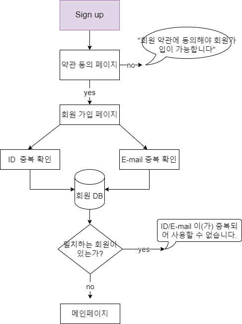
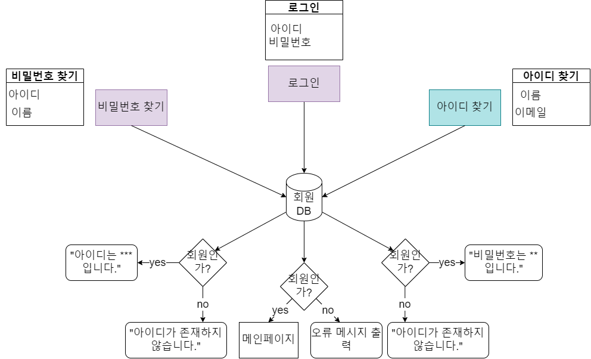
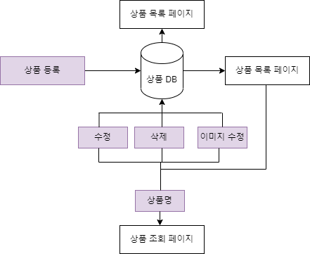
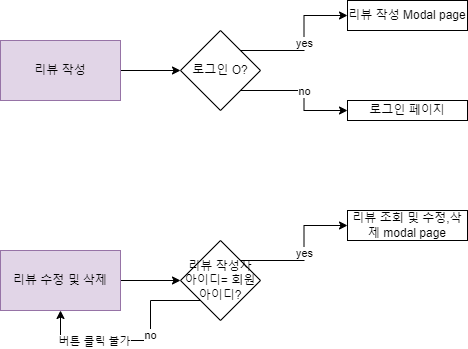
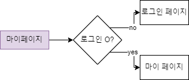
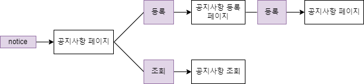

## 쇼핑몰 홈페이지

  

### 기술 스택

프론트 : HTML, CSS, JS, AJAX, JQUERY

백엔드 : SPRING BOOT, MYSQL, MYBATIS 

  

### 메뉴 구조

  

### 주요 기능

 

◎ <b>회원가입</b>

​	

  

◎ <b>로그인 + 아이디, 비밀번호 찾기</b>

  

 ◎ <b>상품</b>

  

◎ <b>리뷰</b>

  

◎ <b>마이페이지</b>

  

◎ <b>공지사항</b>

