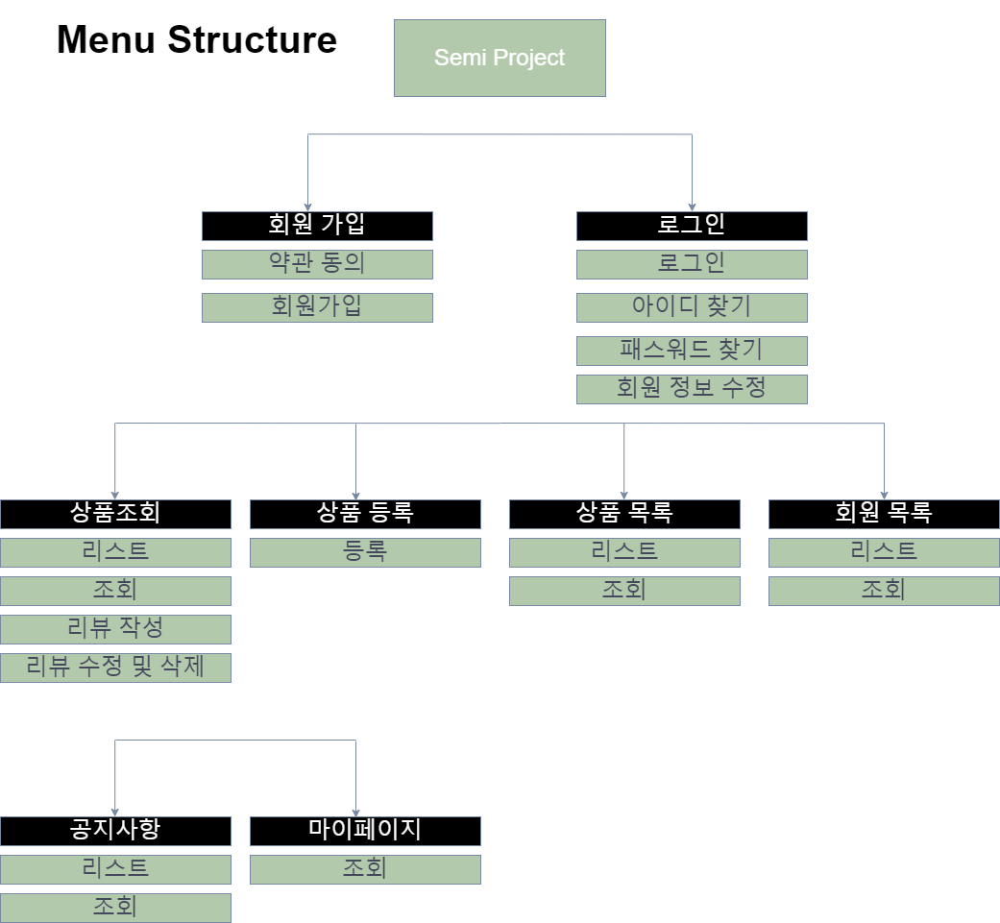

## 쇼핑몰 홈페이지

### 기술 스택

프론트 : HTML, CSS, JS, AJAX, JQUERY

백엔드 : SPRING BOOT, MYSQL, MYBATIS 

### 메뉴 구조

### 주요 기능

- 회원

1. 회원가입

​	

2. 로그인

3. 아이디, 비밀번호 찾기

- 상품

1. 상품등록(관리자)
2. 상품목록(관리자)
3. 회원목록(관리자)
4. 주문목록(관리자)(X)

- 리뷰

1. 리뷰 생성
2. 리뷰 조회
3. 리뷰 수정 및 삭제

- 마이페이지

- 공지사항

1. 

<button type="submit" class = ""></button>

<button id = "" class = ""></button>

위의 버튼의 type을 submit으로 설정하고 아래 버튼의 type을 설정하지 않으면 위의 버튼을 따라 자동으로 submit으로 설정된다.
