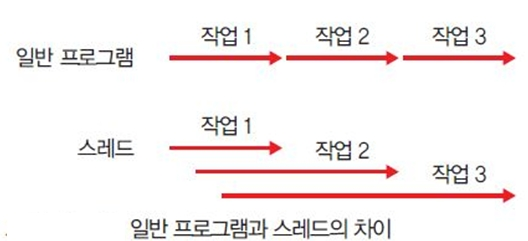
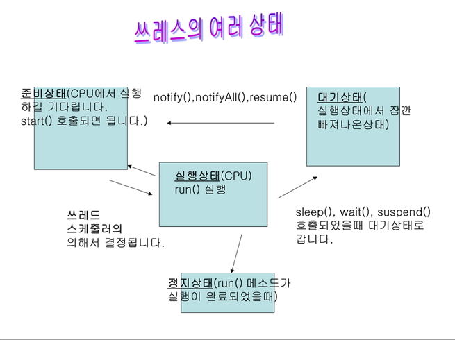
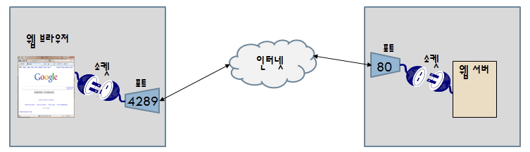
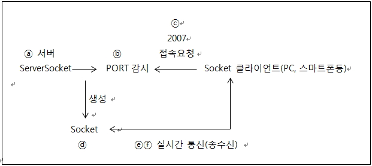
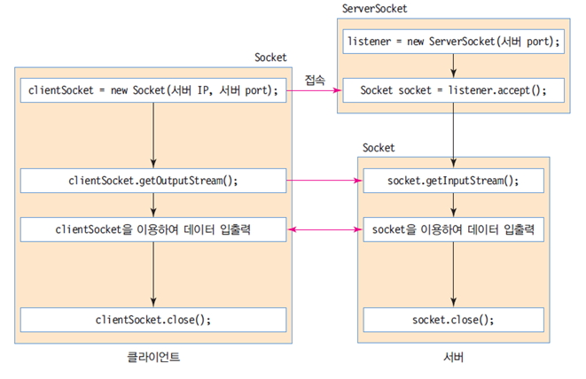

### DAY 13(4/21 Thu)

---

[Thread](#thread)

[Socket, ServerSocket](#socket과-serversocket)

[이클립스 에러](#이클립스-에러)

[Thread 문자열 전송 기반의 채팅](#thread-문자열-전송-기반의-채팅)


##### Thread

---




- 하나의 프로그램에서 여러 개를 동시에 처리하는 기능
- 독립된 작업처리 단위로 프로세스를 구성한다
- 메소드(함수)단위의 처리 모듈 이며 process의 구성 요소이다
- Thread는 많이 발생해도 자원을 공유함으로 Process에 비해 시스템에 적은 부담이 된다
- 스레드 스케줄러에 의해서 스레드의 여러상태중 실행상태로 변경할 수 있다.
- 스레드의 상태는 준비상태, 실행상태, 대기상태, 정지상태가 있다.
- run()메소드안에 처리로직을 구현하거나 처리로직을 호출하는 로직이 구현되어있다
- 자바의 스레드는 많은 Reference 참조로 인해 C언어의 스레드보다 속도 및 안정성이 떨어져 접속자가 많은 네트워크 관련 프로그램에 사용을 하지 않는다. Hash Code 관리 부분에 많은 리소스가 소모된다.


###### Thread의 상태



1. start()

   - 스레드를 스레드 스케줄러에 등록하고 준비상태에서 실행을 기다린다.

   - 이 메소드를 실행했다고해서 바로 스레드가 실행이 되는 것은 아님
   - JVM은 스레드를 실행할 수 있는 여유가 생겼을 때 자신이 작성한 스레드 스케줄러에 의해서 스레드의 run()메소드를 호출한다.

2. run()

   - JVM이 호출하는 콜백메소드로 여기서 콜백 메소드는 개발자가 호출을 코드상에 지시 하는 것이 아니라 JVM이 호출하는 메소드를 말하는 것으로 이 run()메소드 안에는 스레드 상태 에서 처리하려고 하는 모든 비즈니스 로직이 구현되어 있어야 하며 가장 중요한 메소드이다. 

3. sleep()

   - 지정된 시간동안 스레드를 쉬게하고, 그 시간이 지나면 다시 쓰레드가 작동된다. (천 분의 1초)


###### 스레드 실습

1) Thread 클래스를 상속받은 경우

   ```
   class MyThread extends Thread{ 
       private int num; 
       private String name; 
        
       public MyThread(String a, int b) { 
           name = a; 
           num = b; 
       } 
        
       public void run() {  //Callback 메소드 
           for(int i=0; i<num ; i++){
               System.out.println(name + " : " + i); 
           } 
       } 
   }
   public class ThreadTest1{ 
       public static void main(String args[]) { 
           MyThread t1 = new MyThread("first", 1000); 
           MyThread t2 = new MyThread("second", 1000); 
           MyThread t3 = new MyThread("third", 1000); 
   
           t1.start();  
           t2.start();  
           t3.start();          
       } 
   } 
   ```

   

2. Runnable 인터페이스를 사용한 경우

   ```
   class ThreadOne implements Runnable { 
       private int num; 
       private String name; 
       public ThreadOne(String a, int b) { 
           name = a; 
           num = b; 
       } 
            public void run(){ 
           for(int i=0; i<num;i++)
               System.out.println(name + " : " + i); 
       } 
   } 
   public class ThreadTest2{ 
       public static void main(String args[]) { 
           //Runnable Interface를 구현한 클래스 객체를  
           //Thread 클래스의 생성자로 할당합니다. 
           Thread t1 = new Thread(new ThreadOne("first", 1000)); 
           Thread t2 = new Thread(new ThreadOne("second", 1000)); 
           Thread t3 = new Thread(new ThreadOne("third", 1000)); 
           t1.start();          
           t2.start();  
           t3.start();  
       } 
   } 
   ```

   

3. Sleep 메소드

   ```
   class RunThread2 extends Thread {   
       public RunThread2(String name) { 
           super(name); 
       } 
       public void run() { 
           for ( int i = 1; i <= 30000000 ; i++ ) { 
               if ( i % 50 == 0 ){ 
                   System.out.println("Thread [" + getName() + "] : " + i); 
                   try{ 
                      //sleep(1); //0.001초 
                      System.out.print(""); 
                   }catch(Exception e){ } 
               } 
           } 
       }     
   } 
   public class SchedulingTest2 { 
       public static void main(String args[]) { 
           Thread[] t = new RunThread2[5]; 
           t[0] = new RunThread2("☆"); 
           t[1] = new RunThread2("★");    
           t[2] = new RunThread2("◆");  
           t[3] = new RunThread2("◇"); 
           t[4] = new RunThread2("○"); 
            
           t[0].start();  
           t[1].start(); 
           t[2].start();          
           t[3].start(); 
           t[4].start(); 
       }  
   } 
   ```

   

4. 우선순위 스레드

   ```
   class RunThread4 extends Thread {   
       public RunThread4(String name) { 
           super(name); 
      } 
       public void run() { 
           for ( int i = 1; i <= 10000 ; i++ ) { 
               if ( i % 50 == 0 ) 
                   System.out.println("Thread [" + getName() + "] : " + i); 
   
               try{ 
                   sleep(1); //0.001초 
               }catch(InterruptedException e){ } 
   
           } 
       }     
   } 
   public class SchedulingTest4 { 
       public static void main(String args[]) { 
           Thread[] t = new RunThread4[3]; 
           t[0] = new RunThread4("☆"); 
           t[1] = new RunThread4("◑"); 
           t[2] = new RunThread4("○");          
           t[0].start();  
           t[0].setPriority(1); 
           t[1].start(); 
           t[1].setPriority(5); 
           t[2].start();         
           t[2].setPriority(10); 
           /* 
           System.out.println("t[0]" + t[0].getPriority()); 
           System.out.println("t[1]" + t[1].getPriority()); 
           System.out.println("t[2]" + t[2].getPriority()); 
           */         
       }  
   } 
   
   ```

   

##### Socket과 ServerSocket

---

- ServerSocket: 클라이언트보다 먼저 실행되어 클라이언트의 접속 요청을 기다리며, 클라이언트가 접속하면 양방향 통신을 할 수 있는 Socket 객체를 생성한다 

- Socket: 다른 Socket과 데이터를 송수신 한다.

  

- Network 프로그램의 운영순서

  ⓐ Server: ServerSocket 생성 
  ⓑ Server: 포트감시 시작, Client의 접속을 기다림 
  ⓒ Client: Socket 생성시에 인자 값으로 서버의 IP, PORT를 지정, 서버에 접속 요구 
  ⓓ Server: Client의 요구를 받아 Socket 객체 생성 
  ⓔ Server: 생성된 Socket 객체를 이용해 Client에게 데이터를 보냄 
  ⓕ Client: Socket객체로 데이터를 받고 필요한 데이터를 다시 서버로 전송함 

  

- 하나의 접속자와 Socket 양방향 연결 후 포트 감시(접속 대기) 계속 진행
- Client 쪽의 Socket PORT는 사용하지 않는 PORT로 무작위로 발생한다.




###### 실습

1. 서버

   ```
   import java.io.BufferedWriter;
   import java.io.IOException;
   import java.io.InputStream;
   import java.io.OutputStreamWriter;
   import java.net.InetAddress;
   import java.net.ServerSocket;
   import java.net.Socket;
    
   public class TestServer {
    
     public static void main(String[] args) {
        System.out.println("***** 개발자 서버 프로그램 작동됨 *****");
        ServerSocket server = null;
        
        try {
         server = new ServerSocket(2022);
         while(true) {
           System.out.println("클라이언트 접속 대기중******");
           Socket client = server.accept(); //Lock
           
           //클라이언트 ip
           InetAddress ia = client.getInetAddress();
           String ip = ia.getHostAddress();
           int port = client.getLocalPort();
           
           System.out.println("클라이언트 정보:Local port-"+port+"ip-"+ip);
           
           //클리이언트로 환영 메세지 보내기
           BufferedWriter writer = new BufferedWriter(
           new OutputStreamWriter(client.getOutputStream()));
           
           writer.write("개발자 서버 접속 하신것을 환영합니다.");
           writer.flush();
           
           client.close(); //접속한 클라이언트와 연결 닫는다.
           
         }
         
       } catch (IOException e) {
         // TODO Auto-generated catch block
         e.printStackTrace();
       } finally {
         try {
           server.close();
           System.out.println("서버 작동을 종료합니다.");
         } catch (IOException e) {
           // TODO Auto-generated catch block
           e.printStackTrace();
         }
       }
        
       //아무키나 누를 때까지 대기합니다. 
        try{ 
            InputStream is = System.in; 
            is.read(); 
        }catch(Exception e){ 
             
        } 
        System.out.println("서버 프로그램 실행을 종료합니다."); 
    
     }
    
   }
   ```

   

2. 클라이언트

   ```
   import java.io.BufferedReader;
   import java.io.IOException;
   import java.io.InputStream;
   import java.io.InputStreamReader;
   import java.net.InetAddress;
   import java.net.Socket;
   import java.net.UnknownHostException;
    
   public class TestClient {
    
     public static void main(String[] args) {
       System.out.println("클라이언트 프로그램 작동.....");
    
       Socket socket = null;
       
       try {
         socket = new Socket(args[0],2022);
         System.out.println("서버에 연결 되었습니다....");
         
         InetAddress ia = socket.getInetAddress();
         int port = socket.getLocalPort();
         String ip = ia.getHostAddress();
         System.out.println("접속한 서버정보: loca port-"+port+" 서버ip-"+ip);
         
         BufferedReader reader = 
             new BufferedReader(new InputStreamReader(socket.getInputStream()));
         
         String line = reader.readLine();
         System.out.println(line);
         
       } catch (UnknownHostException e) {
         // TODO Auto-generated catch block
         e.printStackTrace();
       } catch (IOException e) {
         // TODO Auto-generated catch block
         e.printStackTrace();
       } finally {
         try {
           socket.close();
           System.out.println("서버와 접속을 종료했습니다.");
         } catch (IOException e) {
           // TODO Auto-generated catch block
           e.printStackTrace();
         }
         
       }
       
      //아무키나 누를 때까지 대기합니다. 
       InputStream is = System.in; 
       try{ 
           is.read(); 
       }catch(Exception e){ 
            
       }    
       System.out.println("Client 프로그램 실행을 종료합니다.");         
    
     }
    
   }
   ```

   

##### 이클립스 에러

---


- Error: Could not find or load main class day13.TestClient
  Caused by: java.lang.ClassNotFoundException: day13.TestClient

이클립스가 main() 메소드를 인식조차 못하고 있는 상황이다. 패키지 내의 파일들이 많아지면서 이클립스가 파일을 제대로 인식하지 못하는 이클립스 오류이다.  패키지를 새로 만들어서 작동시키지 정상적으로 작동한다. 


##### Thread 문자열 전송 기반의 채팅

---

1. Server

   ```
   import java.io.BufferedReader; 
   import java.io.BufferedWriter; 
   import java.io.IOException; 
   import java.io.InputStreamReader; 
   import java.io.OutputStreamWriter; 
   import java.net.InetAddress; 
   import java.net.ServerSocket; 
   import java.net.Socket; 
    
   public class ChatServerThread { 
        
       private Socket socket=null; 
       private ServerSocket server = null; 
       public void serverStart(){ 
           System.out.println("접속자를 기다리는 중입니다."); 
           try { 
               server = new ServerSocket(2007); 
               socket = server.accept(); 
                
               InetAddress ia = socket.getInetAddress(); 
               int port = socket.getLocalPort();// 접속에 사용된 PORT  
               String ip = ia.getHostAddress(); // 원격 Client IP  
                
               System.out.print("클라이언트 접속-Local Port: "+ port); 
               System.out.println(" Client IP: " + ip); 
                
               //데이터를 읽어오는 스레드 
               ChatServerReadHandler read = new ChatServerReadHandler(socket); 
               read.start(); 
               //데이터를 보내는 스레드 
               ChatServerSendHandler send = new ChatServerSendHandler(socket); 
               send.start(); 
           } catch(IOException ioe) { 
               System.err.println("연결이 되어 있지 않습니다."); 
           } finally { 
               try { 
                   server.close(); 
               } catch(IOException ignored) {} 
           } 
            
       } 
    
       public static void main(String[] args) { 
           ChatServerThread cs = new ChatServerThread(); 
           cs.serverStart(); 
       } 
   } 
    
   /** 
    * 데이터를 읽어옵니다. 
    * @author stu 
    * 
    */ 
   class ChatServerReadHandler extends Thread{ 
       private Socket socket; 
       private String line;   //서버로부터 읽어온 문자열 저장     
    
       public ChatServerReadHandler() { 
           System.out.println("프로그램이 초기화 되지 않았습니다."); 
       } 
        
       public ChatServerReadHandler(Socket socket) { 
           this.socket = socket;   
       } 
    
       public void run() { 
           try { 
               BufferedReader reader = new BufferedReader(new InputStreamReader(socket.getInputStream())); 
               while(true){ 
                   line = reader.readLine(); 
                    
                   if (line == null){  
                       break; 
                   } 
                   System.out.println("받은글: " + line); 
                   System.out.print("☞ "); 
               } 
    
           } catch(IOException ignored) { 
           } finally { 
               try { 
                   socket.close(); 
               } catch(IOException ignored) {} 
           } 
       } 
    
   } 
    
   /** 
    * 데이터를 보냅니다. 
    * @author stu 
    * 
    */ 
   class ChatServerSendHandler extends Thread{ 
       private Socket socket; 
       private BufferedWriter writer; 
       private BufferedReader in;            
       private String s=""; 
    
       public ChatServerSendHandler() { 
           System.out.println("프로그램이 초기화 되지 않았습니다."); 
       } 
        
       public ChatServerSendHandler(Socket socket) { 
           this.socket = socket; 
           try{ 
               writer = new BufferedWriter(new OutputStreamWriter(socket.getOutputStream())); 
               in = new BufferedReader(new InputStreamReader(System.in)); 
           } catch (Exception e) { 
               System.err.println("연결이 되어 있지 않습니다."); 
           }    
       } 
    
       public void run() { 
           try { 
               while(true) { 
                   System.out.print("☞ "); 
                   s = in.readLine(); //키보드로부터 입력 
                   if(s.equals("999")){ 
                       break; //종료코드 
                   } 
                   writer.write(s); 
                   writer.newLine();  //줄바뀜 기호가 있어야 BufferedReader의 readLine()이 인식함 
                   writer.flush();    //client로 전송  
    
                   //System.out.println("보낸 글:" + s);//입력받은 내용 출력 
               } 
           } catch(Exception ignored) { 
    
           } finally { 
               try { 
                   socket.close(); 
               } catch(IOException ignored) {} 
           } 
       } 
    
   } 
   ```

   

2. Client

```
import java.io.BufferedReader; 
import java.io.BufferedWriter; 
import java.io.IOException; 
import java.io.InputStreamReader; 
import java.io.OutputStreamWriter; 
import java.net.InetAddress; 
import java.net.Socket; 
 
public class ChatClientThread { 
    private Socket socket = null; 
     
    public void clientStart(String ip){ 
        System.out.println("클라이언트 프로그램 작동....."); 
        try { 
            socket = new Socket(ip, 2007); 
             
            InetAddress ia = socket.getInetAddress(); 
            int local_port = socket.getLocalPort();// 접속에 사용된 PORT 
            int server_port = socket.getPort();// 접속에 사용된 PORT 
            String server_ip = ia.getHostAddress(); // 원격 Client IP  
             
            System.out.print("클라이언트 접속-Local Port: "+ local_port); 
            System.out.print(" Server IP: " + server_ip); 
            System.out.println(" Server PORT: " + server_port);             
             
            //데이터를 읽어오는 스레드 
            ChatClientReadHandler read = new ChatClientReadHandler(socket); 
            read.start(); 
            //데이터를 보내는 스레드 
            ChatClientSendHandler send = new ChatClientSendHandler(socket); 
            send.start(); 
             
        } catch(IOException ioe) { 
            System.err.println("연결이 되어 있지 않습니다."); 
        } finally { 
            try { 
                if(socket == null){ 
                    socket.close();                     
                } 
            } catch(IOException ignored) {} 
        } 
        
    } 
 
    public static void main(String[] args) { 
        ChatClientThread cc = new ChatClientThread(); 
        cc.clientStart(args[0]); 
    } 
} 
 
/** 
 * 데이터를 읽어옵니다. 
 * @author stu 
 * 
 */ 
class ChatClientReadHandler extends Thread{ 
    private Socket socket; 
    private String line;   //서버로부터 읽어온 문자열 저장     
 
    public ChatClientReadHandler() { 
        System.out.println("프로그램이 초기화 되지 않았습니다."); 
    } 
     
    public ChatClientReadHandler(Socket socket) { 
        this.socket = socket;   
    } 
 
    public void run() { 
        try { 
            BufferedReader reader = new BufferedReader(new InputStreamReader(socket.getInputStream())); 
            while(true){ 
                line = reader.readLine(); 
                 
                if (line == null){  
                    break; 
                } 
                 
                System.out.println("받은글: " + line); 
                System.out.print("☞ "); 
            } 
        } catch(IOException ignored) { 
            System.err.println("연결이 되어 있지 않습니다."); 
        } finally { 
            try { 
                socket.close(); 
            } catch(IOException ignored) {} 
        } 
    } 
 
} 
 
/** 
 * 데이터를 보냅니다. 
 * @author stu 
 * 
 */ 
class ChatClientSendHandler extends Thread{ 
    private Socket socket; 
    private BufferedWriter writer; 
    private BufferedReader in;            
    private String s=""; 
 
    public ChatClientSendHandler() { 
        System.out.println("프로그램이 초기화 되지 않았습니다."); 
    } 
     
    public ChatClientSendHandler(Socket socket) { 
        this.socket = socket; 
        try{ 
            writer = new BufferedWriter(new OutputStreamWriter(socket.getOutputStream())); 
            in = new BufferedReader(new InputStreamReader(System.in)); 
        } catch (Exception e) { 
            System.err.println("연결이 되어 있지 않습니다."); 
        }    
    } 
 
    public void run() { 
        try { 
            while(true) { 
                System.out.print("☞ "); 
                s = in.readLine(); //키보드로부터 입력 
                if(s.equals("999")){ 
                    break; //종료코드 
                } 
                writer.write(s); 
                writer.newLine();  //줄바뀜 기호가 있어야 BufferedReader의 readLine()이 인식함 
                writer.flush(); 
                //System.out.println("보낸 글:" + s);//입력받은 내용 출력 
            } 
        } catch(Exception ignored) { 
 
        } finally { 
            try { 
                socket.close(); 
            } catch(IOException ignored) {} 
        } 
    } 
 
} 
```

