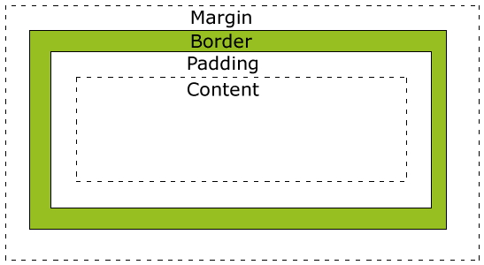
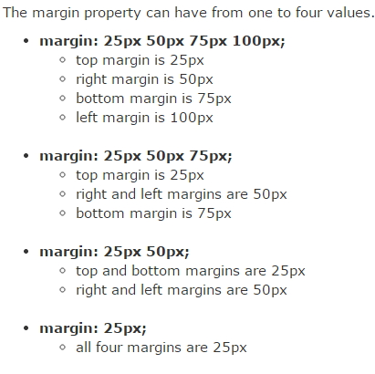
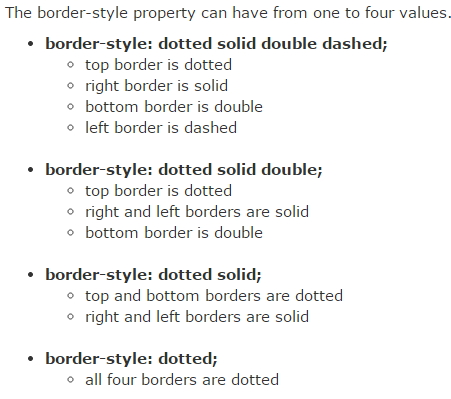
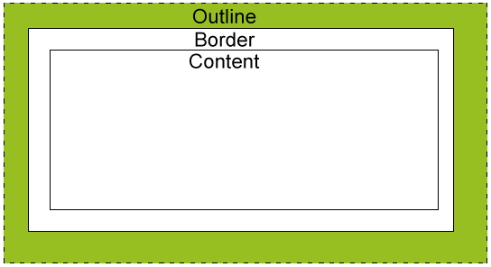

### DAY 20(5/2 Mon)

---

[Selectors](#selectors)

[Background](#background)

[Margin](#margin)

[Padding](#padding)

[Border](#border)

[Outline](#outline)

[Hidden](#hidden)

[Display](#display)

[Position](#position)

[Overflow](#overflow)

[Float](#float)

[FlexBox](#flexbox)


#### CSS

---

##### Selectors

Universal : *

Type : Tag

ID : #id

Class : .class

State : :

Attribute : []


```html
<!DOCTYPE html>
<html>
<head>
<meta charset="UTF-8">
<title>Insert title here</title>
<style>
	* {
		color : green; /* '*' : 전부 다 적용   */
	}

	li {
	color : blue;
	}
	
	li#special { /* '#' : id 적용*/
	color : pink;
	}
	
	.red {   /*  '.' : class 적용  */
	width : 100px;
	height: 100px;
	background : yellow;
	}
	
	
	button:hover { /* ':' : state(상태) */
	color : red;
	background : beige;
	}
	
	/* [] */
	
	a[href] {
	color : purple;
	}
	
	
	a[href='naver.com'] {
	color : skyblue;
	}
	
	a[href^='naver'] { /* '^' : naver로 시작하는 링크 */
	color : red;
	}
	
	a[href$='.com'] { /*  '$' : .com으로 끝나는 링크 */
	color : purple;
	}

</style>

</head>
<body>
	<ol>
		<li id='special'>First</li>
		<li>second</li>
	</ol>
	<h1 id='special'>Hello</h1>
	<button>Button 1</button>
	<button>Button 2</button>
	<div class='red'></div>
	<div class='blue'></div>
	<a href="naver.com">Naver</a>
	<a href="googlenaver.com">Google</a>
	<a>Empty</a>
</body>
</html>
```


##### Background

* background-color

* background-image

* background-repeat : 배경이미지의 반복

  - repeat : 반복 적용(default)
  - repeat-x : 배경이미지가 가로방향으로만 적용
  - repeat-y : 배경이미지가 세로방향으로만 적용
  - no-repeat : 한번만 적용

  ```html
  <!DOCTYPE html>
  <html>
  <head>
  <style>
  	body {
  		background-image: url("tree.jpg");
  		background-repeat: no-repeat;
  	}
  </style>
  </head>
  <body>
   
  	<h1>Hello World!</h1>
  	<p>W3Schools background image example.</p>
  	<p>The background image is only showing once, but it is disturbing the reader!</p>
  	
  </body>
  </html>
  ```

* background-position --> background-repeat : no-repeat 일때, 이미지의 위치를 변경.

  - top left / top center / top right
  - center left / center center / center right
  - bottom left / bottom center / bottom right

  ```html
  <!DOCTYPE html>
  <html>
  <head>
  <style>
  	body {
  		background-image: url("tree.jpg");
  		background-repeat: no-repeat;
  		background-position: right top;
  		margin-right: 200px;
  	}
  </style>
  </head>
  <body>
   
  	<h1>Hello World!</h1>
  	<p>W3Schools background no-repeat, set position example.</p>
  	<p>Now the background image is only shown once, and positioned away from the text.</p>
  	<p>In this example we have also added a margin on the right side, so the background image will never disturb the text.</p>
  </body>
  </html>
  ```

* background-attachment : 배경 이미지를 뷰포트 내에서 고정할지, 아니면 자신의 컨테이닝 블록과 함께 스크롤할지 지정한다.

  ```html
  <!DOCTYPE html>
  <html>
  <head>
  <style> 
  #myDIV {
      width: 300px;
      height: 300px;
      background: lightblue url('tree.jpg') no-repeat;
      color: white;
      overflow: auto;
  }
  </style>
  </head>
  <body>
   
  <p>Click the radio buttons and scroll the DIV element to see the effect of the background-attachment property:</p>
   
  <form name="myForm">
    <input type="radio" name="myAtt" value="scroll" onclick="myFunction()" checked>scroll <!-- submit하면 value속성에 해당하는 값이 전송된다. -->
    <input type="radio" name="myAtt" value="local" onclick="myFunction()">local
  </form>
   
  <div id="myDIV">
    <h1>Hello</h1>
    <h1>Hello</h1>
    <h1>Hello</h1>
    <h1>Hello</h1>
    <h1>Hello</h1>
    <h1>Hello</h1>
    <h1>Hello</h1>
    <h1>Hello</h1>
    <h1>Hello</h1>
    <h1>Hello</h1>
    <h1>Hello</h1>
    <h1>Hello</h1>
    <h1>Hello</h1>
    <h1>Hello</h1>
    <h1>Hello</h1>
    <h1>Hello</h1>
    <h1>Hello</h1>
    <h1>Hello</h1>
    <h1>Hello</h1>
    <h1>Hello</h1>
  </div>
   
  <script>
  function myFunction() {
      if (document.forms["myForm"]["myAtt"][0].checked) {
        document.getElementById("myDIV").style.backgroundAttachment = "scroll";
      } else {
        document.getElementById("myDIV").style.backgroundAttachment = "local";
      }
  }
  </script>
   
  </body>
  </html>
  ```

  

##### 테두리




###### Margin

```html
<!DOCTYPE html>
<html>
<head>
<style>
p {
    background-color: yellow;
}
 
p.ex {
    margin-top: 100px;
    margin-bottom: 100px;
    margin-right: 150px;
    margin-left: 50px;
}
</style>
</head>
<body>
 
<p>This is a paragraph with no specified margins.</p>
<p class="ex">This is a paragraph with specified margins.</p>
 
</body>
</html>
```




###### Padding

```html
<!DOCTYPE html>
<html>
<head>
<style>
p {
    background-color: yellow;
}
 
p.padding {
    padding-top: 25px;
    padding-right: 50px;
    padding-bottom: 25px;
    padding-left: 50px;
}
</style>
</head>
<body>
 
<p>This is a paragraph with no specified padding.</p>
<p class="padding">This is a paragraph with specified paddings.</p>
 
</body>
</html>

```


###### Border




```html
<!DOCTYPE html>
<html>
<head>
<style>
p {
    border-top-style: dotted;
    border-right-style: solid;
    border-bottom-style: dotted;
    border-left-style: solid;
}
</style>
</head>
<body>
 
<p>2 different border styles.</p>
 
</body>
</html>
```


###### Outline




```html
<!DOCTYPE html>
<html>
<head>
<style>
p {
    border: 1px solid red;
    outline: green dotted thick;
}
</style>
</head>
<body>
 
<p><b>Note:</b> IE8 supports the outline properties only if a !DOCTYPE is 
specified.</p>
 
</body>
</html>
```


##### Hidden

```html
<!DOCTYPE html>
<html>
<head>
<style>
h1.hidden {
    visibility: hidden; /* 내용만 숨김. 영역은 남음 */
}
</style>
</head>
<body>
 
<h1>This is a visible heading</h1>
<h1 class="hidden">This is a hidden heading</h1>
<p>Notice that the hidden heading still takes up space.</p>
 
</body>
</html>
```

```html
<!DOCTYPE html>
<html>
<head>
<style>
h1.hidden { 
    display: none; /* 내용과 영역 모두 숨김 */
}
</style>
</head>
<body>
 
<h1>This is a visible heading</h1>
<h1 class="hidden">This is a hidden heading</h1>
<p>Notice that the hidden heading still takes up space.</p>

</body>
</html>
```


##### Display

Block elements:

* h1
* p
* li
* div

Inline elements:

- span
- a


display : inline ; contents가 있어야 보여진다. 콘텐츠 크기로 보여진다.

-->한줄에 여러개가 보여진다.

display : block ; 콘텐츠 크기와 상관없어 css의 width, height 사이즈로 보여준다.

-->한줄에 하나만 보여진다.

display : inline-block ; 콘텐츠 크기와 상관없어 css의 width, height 사이즈로 보여준다.

-->한줄에 여러개가 보여진다.

```css
div, span {
  width:80px;
  height:80px;
  margin:20px
  
}
 
div {
  background:red;
}
 
span {
  background: blue;
}
```


##### Position

\- position : static (default) - html에 정의된 순서대로 브라우저에 자연스럽게 보여줌 

\- position : relative - 나의 원래자리에서 상대적으로 이동

\- position : absolute - 내 아이템이 담겨있는 상자에서 이동됨

\- position : fixed - 내 아이템이 담겨있는 상자에서 벗어나 원도우 즉 page 상에서 이동된다

\- position : sticky - 원래자리에 고정되어, 스크롤바를 이동해도 그자리에 그대로 있다.


##### Overflow

- contents가 Box 영역을 벗어났을때 처리되는 방법
- overflow : visible|hidden|scroll|auto|initial|inherit;
- overflow-x, overflow-y
- initial : 검정색
- inherit : 부모 태그의 색을 이어받음

```html
<!DOCTYPE html>
<html>
<head>
<style>
div.scroll {
    background-color: #00FFFF;
    width: 100px;
    height: 100px;
    overflow: scroll;
}
 
div.hidden {
    background-color: #00FF00;
    width: 100px;
    height: 100px;
    overflow: hidden;
}
</style>
</head>
<body>
 
<p>The overflow property specifies what to do if the content of an element exceeds the size of the element's box.</p>
 
<p>overflow:scroll</p>
<div class="scroll">You can use the overflow property when you want to have better control of the layout. The default value is visible.</div>
 
<p>overflow:hidden</p>
<div class="hidden">You can use the overflow property when you want to have better control of the layout. The default value is visible.</div>
 
</body>
</html>
```


##### Float

- 문서에 사진이나 글그림을 왼쪽이나 오른쪽에 띄어서 정렬하거나 각 객체를 오른쪽이나 왼쪽으로 정렬하여 문서를 배치한다
- Block형 요소에만 사용된다
- float : left|right|none;

```html
<!DOCTYPE html>
<html>
<head>
<style>
.thumbnail {
    float: left;
    width: 110px;
    height: 90px;
    margin: 5px;
}
 
.text_line {
    clear: both; /* 이미지들 사이에 다른 태그가 있는 경우 정렬이 어긋날 수 있다. 그때 사용. */
    margin-bottom: 2px;
}
</style>
</head>
<body>
 
<h3>Image Gallery</h3>
<p>Try to resize the browser-window to see what happens when the images does not have enough room.</p>


 
<h3 class="text_line">Second row</h3>


 
</body>
</html>
```


##### FlexBox

```html
<!DOCTYPE html>
<html>
<head>
  <meta charset="utf-8">
  <meta name="viewport" content="width=device-width">
  <title>JS Bin</title>
<style>
	.container{
		background : beige;
		/*height : 100%; --> 부모높이의 100%를 채운다는 의미*/
		height : 100vh; /* vh(view height) : 뷰 전체 높이*/
		display : flex; /* display : flex 지정 시, flex-direction 기본 값은 row */
		flex-direction : column;
		/* flex-direction:  column; */
		/* flex-direction:  row-reverse; */
		/* flex-direction:  column-reverse; */

		/*flex-wrap : nowrap --> 기본값, 브라우저 크기가 줄어들어도 한줄로 보임*/
		flex-wrap:wrap; /* 브라우저 크기가 줄어들면 여러줄로 보임*/
		/*flex-wrap : wrap-reverse --> 여러줄에 보여주지만 역순으로 보여줌*/

		/* flex-flow : row wrap;
		flex-flow : column wrap;  --> flex-wrap과 동일한 기능   */

		justify-content : flex-end; /* 오른쪽으로 붙임 */
		/* justify-content : flex-start ; --> 왼쪽으로 붙임*/
		/* justify-content : center; --> 가운데 정렬 */
		/* justify-content : space-around; */
		/* 균등하게 간격을 만듬 */
		/* justify-content : space-evenly; */ 
		/* justify-content : space-between; */ 

		
}

.item{
	width : 40px;
	height : 40px;
	border : 1px solid black;
}
.item1 {
  background:#ef9a9a;
}
.item2 {
  background:#f48fb1;
}
.item3 {
  background:#ce93d8;
}
.item4 {
  background:#b39ddb;
}
.item5 {
  background:#90caf9;
}
.item6 {
  background:#a5d6a7;
}
.item7 {
  background:#e6ee9c;
}
.item8 {
  background:#fff59d;
}
.item9 {
  background:#ffcc80;
}
.item10 {
  background:#ffab91;
}

</style>

</head>
<body>
  <div class="container">
    <div class="item item1">1</div>
    <div class="item item2">2</div>
    <div class="item item3">3</div>
    <div class="item item4">4</div>
    <div class="item item5">5</div>
    <div class="item item6">6</div>
    <div class="item item7">7</div>
    <div class="item item8">8</div>
    <div class="item item9">9</div>
    <div class="item item10">10</div>
    
    <!-- <div class="item item1">1</div>
    <div class="item item2">2</div>
    <div class="item item3">3</div>
    <div class="item item4">4</div>
    <div class="item item5">5</div>
    <div class="item item6">6</div>
    <div class="item item7">7</div>
    <div class="item item8">8</div>
    <div class="item item9">9</div>
    <div class="item item10">10</div> -->
  </div>
</body>
</html>
```

```html
<!DOCTYPE html>
<html>
<head>
  <meta charset="utf-8">
  <meta name="viewport" content="width=device-width">
  <title>JS Bin</title>
<style>
	.container{
		background : beige;
		/*height : 100%; --> 부모높이의 100%를 채운다는 의미*/
		height : 100vh; /* vh(view height) : 뷰 전체 높이*/
		display : flex; /* display : flex 지정 시, flex-direction 기본 값은 row */
		flex-direction : column;
		/* flex-direction:  column; */
		/* flex-direction:  row-reverse; */
		/* flex-direction:  column-reverse; */

		/*flex-wrap : nowrap --> 기본값, 브라우저 크기가 줄어들어도 한줄로 보임*/
		flex-wrap:wrap; /* 브라우저 크기가 줄어들면 여러줄로 보임*/
		/*flex-wrap : wrap-reverse --> 여러줄에 보여주지만 역순으로 보여줌*/

		/* flex-flow : row wrap;
		flex-flow : column wrap;  --> flex-wrap과 동일한 기능   */

		justify-content : flex-end; /* 오른쪽으로 붙임 */
		/* justify-content : flex-start ; --> 왼쪽으로 붙임*/
		/* justify-content : center; --> 가운데 정렬 */
		/* justify-content : space-around; */
		/* 균등하게 간격을 만듬 */
		/* justify-content : space-evenly; */ 
		/* justify-content : space-between; */ 

    padding-top : 100px;

		
}

.item{
	width : 40px;
	height : 40px;
	border : 1px solid black;
}
.item1 {
  background:#ef9a9a;
  order : 3; /*order --> 순서바꾸기*/
}
.item2 {
  background:#f48fb1;
  order : 1;
}
.item3 {
  background:#ce93d8;
  order : 2;
}
.item4 {
  background:#b39ddb;
}
.item5 {
  background:#90caf9;
}
.item6 {
  background:#a5d6a7;
}
.item7 {
  background:#e6ee9c;
}
.item8 {
  background:#fff59d;
}
.item9 {
  background:#ffcc80;
}
.item10 {
  background:#ffab91;
}

</style>

</head>
<body>
  <div class="container">
    <div class="item item1">1</div>
    <div class="item item2">2</div>
    <div class="item item3">3</div>
    <!-- <div class="item item4">4</div>
    <div class="item item5">5</div>
    <div class="item item6">6</div>
    <div class="item item7">7</div>
    <div class="item item8">8</div>
    <div class="item item9">9</div>
    <div class="item item10">10</div> -->
    
    <!-- <div class="item item1">1</div>
    <div class="item item2">2</div>
    <div class="item item3">3</div>
    <div class="item item4">4</div>
    <div class="item item5">5</div>
    <div class="item item6">6</div>
    <div class="item item7">7</div>
    <div class="item item8">8</div>
    <div class="item item9">9</div>
    <div class="item item10">10</div> -->
  </div>
</body>
</html>
```

```html
<!DOCTYPE html>
<html>
<head>
  <meta charset="utf-8">
  <meta name="viewport" content="width=device-width">
  <title>JS Bin</title>
<style>
	.container{
		background : beige;
		/*height : 100%; --> 부모높이의 100%를 채운다는 의미*/
		height : 100vh; /* vh(view height) : 뷰 전체 높이*/
		display : flex; /* display : flex 지정 시, flex-direction 기본 값은 row */
		flex-direction : column;
		/* flex-direction:  column; */
		/* flex-direction:  row-reverse; */
		/* flex-direction:  column-reverse; */

		/*flex-wrap : nowrap --> 기본값, 브라우저 크기가 줄어들어도 한줄로 보임*/
		flex-wrap:wrap; /* 브라우저 크기가 줄어들면 여러줄로 보임*/
		/*flex-wrap : wrap-reverse --> 여러줄에 보여주지만 역순으로 보여줌*/

		/* flex-flow : row wrap;
		flex-flow : column wrap;  --> flex-wrap과 동일한 기능   */

		justify-content : flex-end; /* 오른쪽으로 붙임 */
		/* justify-content : flex-start ; --> 왼쪽으로 붙임*/
		/* justify-content : center; --> 가운데 정렬 */
		/* justify-content : space-around; */
		/* 균등하게 간격을 만듬 */
		/* justify-content : space-evenly; */ 
		/* justify-content : space-between; */ 

    padding-top : 100px;
		
}

.item{
	width : 40px;
	height : 40px;
	border : 1px solid black;
}
.item1 {
  background:#ef9a9a;
  flex-grow : 1; /*flex-grow --> 비율에 맞게 item 크기 설정*/
}
.item2 {
  background:#f48fb1;
  flex-shrink: 2; /*flex-shrink --> n배로 줄어든다*/
  flex-basis : default auto;
}
.item3 {
  background:#ce93d8;
  flex-basis : 60%;
  flex : 2 2 auto; /* grow, shrink, basis가 결합됨. 0,1,auto가 기본값 */
}
.item4 {
  background:#b39ddb;
}
.item5 {
  background:#90caf9;
}
.item6 {
  background:#a5d6a7;
}
.item7 {
  background:#e6ee9c;
}
.item8 {
  background:#fff59d;
}
.item9 {
  background:#ffcc80;
}
.item10 {
  background:#ffab91;
}

</style>

</head>
<body>
  <div class="container">
    <div class="item item1">1</div>
    <div class="item item2">2</div>
    <div class="item item3">3</div>
    <!-- <div class="item item4">4</div>
    <div class="item item5">5</div>
    <div class="item item6">6</div>
    <div class="item item7">7</div>
    <div class="item item8">8</div>
    <div class="item item9">9</div>
    <div class="item item10">10</div> -->
    
    <!-- <div class="item item1">1</div>
    <div class="item item2">2</div>
    <div class="item item3">3</div>
    <div class="item item4">4</div>
    <div class="item item5">5</div>
    <div class="item item6">6</div>
    <div class="item item7">7</div>
    <div class="item item8">8</div>
    <div class="item item9">9</div>
    <div class="item item10">10</div> -->
  </div>
</body>
</html>
```


