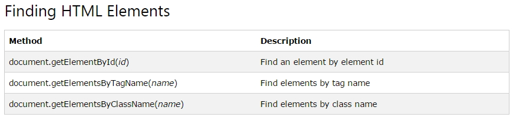
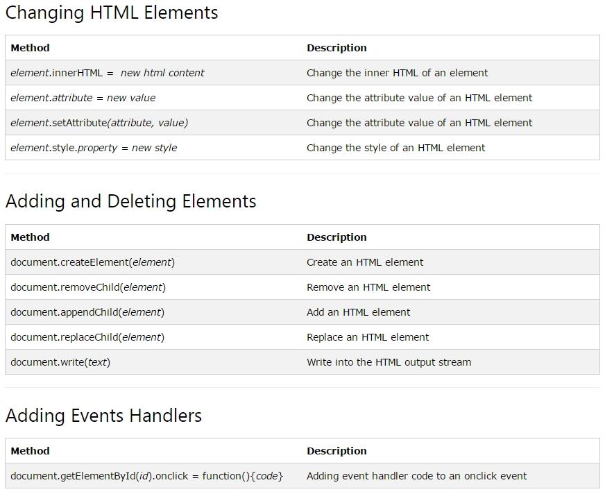

### DAY 25(5/12 Thu)

---

[]()

[]()


##### Finding HTML Elements



```html
<!DOCTYPE html>
<html>
<body>
 
<p id="intro">Hello World!</p>
 
<p>This example demonstrates the <b>getElementById</b> method!</p>
 
<p id="demo"></p>
 
<script>
var myElement = document.getElementById("intro");
document.getElementById("demo").innerHTML = 
"The text from the intro paragraph is " + myElement.innerHTML;
</script>
 
</body>
</html>
```


##### Another Elements




##### 실습

1. 자식 노드의 갯수 산출

   ```html
   <!DOCTYPE html>
   <html>
   <head>
   <meta charset="UTF-8">
   <title>Insert title here</title>
   <script type="text/javascript">
    
   // 페이지 로딩시 실행
   // window 브러우저 내부 객체의 onload 이벤트에 무명의 함수 연결
   window.onload = function(){
       // 변수 선언, divHolder란 이름의 태그 검색 
       var divel = document.getElementById('divHolder');
       
       // 경고창, childNodes: 자식 태그
       alert ("divHolder div의 자식노드의 갯수는 :" + divel.childNodes.length);
   }
    
   </script>
    
   </head>
   <body>
   <div id="divHolder">
       <!-- Ajax 정복 루트 -->
       <div>HTML</div>
       <div>JavaScript</div>
       <div>DOM</div>
       <div>Ajax</div>
   </div>
   </body>
   </html>
   ```

2. 주석을 뺀 태그의 갯수만 산출

   NodeType Named Constant

     1       ELEMENT_NODE

     2       ATTRIBUTE_NODE

     3       TEXT_NODE

     4       CDATA_SECTION_NODE

     5       ENTITY_REFERENCE_NODE

     6       ENTITY_NODE

     7       PROCESSING_INSTRUCTION_NODE

     8       COMMENT_NODE

     9       DOCUMENT_NODE

    10       DOCUMENT_TYPE_NODE

    11       DOCUMENT_FRAGMENT_NODE

    12       NOTATION_NODE

    

   ```html
   <!DOCTYPE html>
   <html lang="en">
   <head>
       <meta charset="UTF-8">
       <meta http-equiv="X-UA-Compatible" content="IE=edge">
       <meta name="viewport" content="width=device-width, initial-scale=1.0">
       <title>Document</title>
       <script>
           window.onload = function(){
               let count = 0;
               let divel = document.getElementById("divHolder");
   
               for(let i = 0; i < divel.childNodes.length; i++){
                   if(divel.childNodes[i].nodeType == 1){
                       count++;
                   }
               }
               alert("자식 엘레멘트(태그) 노드의 갯수는 " + count);
   
           }
       </script>
   </head>
   <body>
       <div id="divHolder">
           <div>HTML</div>
           <div>Javascript</div>
           <div>DOM</div>
           <div>Ajax</div>
       </div>
   </body>
   </html>
   ```

3. DIV 태그의 값을 가져오는 방법

   \- document.all : 도큐멘트 태그안의 태그의 id 또는  name속성을 통틀어 찾습니다.

     비표준이다.

   \- innerText : 태그의 Text값에 접근합니다. 비표준이다

   ```html
   <!DOCTYPE html>
   <html>
   <head>
   <meta charset="UTF-8">
   <title>Insert title here</title>
   <script type="text/javascript">
   window.onload = function(){
       // ⓐ innerText는 div 태그의 값을 가져옵니다.
       var div1text = document.all.div1.innerText;
    
       // ⓑ firstChild.nodeValue는 div2 태그의 값을 가져옵니다.
       var div2el = document.getElementById('div2');
       var div2text = div2el.firstChild.nodeValue;
    
       // ⓒ 모든 브러우저를 호환함
       var div3text = (document.getElementById('div3').textContent)? document.getElementById('div3').textContent : document.getElementById('div3').innerText ;
    
       // 경고창
       alert ("div1text :" + div1text +"\r\n" + "div2text :" + div2text +"\r\n" +
   "div3text :" + div3text );
   }
    </script>
   </head>
   <body>
   <div id='div1'>백두산</div><br>
     <div id='div2'>한라산</div><br>
     <div id='div3'>금강산</div><br>
     <div id='div4'>설악산</div><br>
     <div id='div5'>관악산</div><br>
   </body>
   </html>
   ```

4.  DIV 태그로 내용 저장

   ```html
   <!DOCTYPE html>
   <html lang="en">
   <head>
       <meta charset="UTF-8">
       <meta http-equiv="X-UA-Compatible" content="IE=edge">
       <meta name="viewport" content="width=device-width, initial-scale=1.0">
       <title>Document</title>
       <link rel="stylesheet" href="../style.css">
       <script>
           function setDiv(){
               let str = "<table><tr><td>";
               str += "A0001 - 컴퓨터 A <br>";
               str += "A0002 - 컴퓨터 B <br>";
               str += "A0003 - 컴퓨터 C <br>";
               str += "A0004 - 컴퓨터 D <br>";
               str += "</td></tr></table>";
   
               document.getElementById("div1").innerHTML = str;
               
           }
   
           function removeDiv(){
               let str = "";
               document.getElementById("div1").innerHTML = str;
           }
   
       </script>
   </head>
   <body>
       <div id="div1">*****</div><br>
       <button onclick = "setDiv()">테이블 생성</button>
       <button onclick = "removeDiv()">테이블 삭제</button>
   </body>
   </html>
   ```

5. 태그 생성, 이미지 변경

   ```html
   <!DOCTYPE html>
   <html>
   <head>
   <meta charset="UTF-8">
   <title>Insert title here</title>
   <script type="text/javascript">
       
       function imgShow(){
           // img 태그 생성
           var img = document.createElement("img");
           
           // img 태그의 src속성 설정
           img.src ="http://www.apache.org/images/ac2008us_343x114.jpg";
           
           // imgPlaceHolder DIV 태그 검색
           var holder = document.getElementById("imgPlaceHolder");
           
           // div 태그에 img 태그 추가
           holder.appendChild(img);
       }
       
    </script>
   </head>
   <body>
   <input type="button" onclick="imgShow();" value="이미지 표시"/>
     
   <div id="imgPlaceHolder"></div>
   </body>
   </html>
   ```

6. 갤러리 제작

   ```html
   <!DOCTYPE html>
   <html lang="en">
   <head>
       <meta charset="UTF-8">
       <meta http-equiv="X-UA-Compatible" content="IE=edge">
       <meta name="viewport" content="width=device-width, initial-scale=1.0">
       <title>Document</title>
   
       <style>
           .container{
               background-color: #ece9d8;
               display : flex;
               height : 100vh;
               justify-content: right; 
           }
   
           .mainItem1{
               margin : 100px 10px 0 0;
               width : 700px;
               height : 470px;
               background-color: aqua;
           }
   
           .mainItem2{
               margin : 100px;
               width : 100px;
               height : 450px;
               background-color: white;
               display : flex;
               flex-direction : column;
               justify-content : space-between;    
           }
       </style>
       <script>
           window.onload = function(){
               let img1 = document.createElement("img");
               img1.src = "images/showImg/01.jpg";
               img1.width = 100;
               img1.height = 90;
               let show1Div = document.getElementById("show1");
               show1Div.appendChild(img1);
   
               let img2 = document.createElement("img");
               img2.src ="images/showImg/02.jpg";
               img2.width=100;
               img2.height=90;
               let show2Div = document.getElementById("show2");
               show2Div.appendChild(img2);
       
               let img3 = document.createElement("img");
               img3.src ="images/showImg/03.jpg";
               img3.width=100;
               img3.height=90;        
               let show3Div = document.getElementById("show3");
               show3Div.appendChild(img3);
       
               let img4 = document.createElement("img");
               img4.src ="images/showImg/04.jpg";
               img4.width=100;
               img4.height=90;
               let show4Div = document.getElementById("show4");
               show4Div.appendChild(img4);
       
               let img5 = document.createElement("img");
               img5.src ="images/showImg/05.jpg";
               img5.width=100;
               img5.height=90;
               let show5Div = document.getElementById("show5");
               show5Div.appendChild(img5); 
           }
       </script>
   </head>
   <body>
       <div class='container'>
           <div class='mainItem1' id='showMain'></div>
           <div class='mainItem2'>
               <div class='item item1' id="show1" onclick="show(this)"></div>
               <div class='item item2' id="show2" onclick="show(this)"></div>
               <div class='item item3' id="show3" onclick="show(this)"></div>
               <div class='item item4' id="show4" onclick="show(this)"></div>
               <div class='item item5' id="show5" onclick="show(this)"></div>
           </div>
       </div>
   </body>
   </html>
   ```

7. 체크 상자의 선택 상태를 읽거나 변경하기

   ```html
   ```

   

