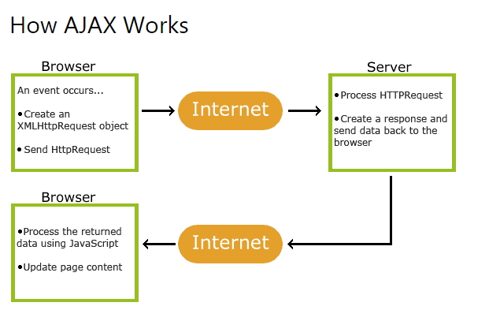
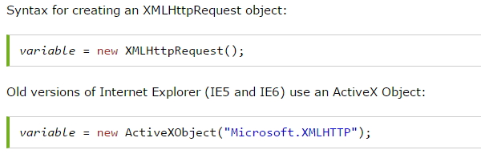
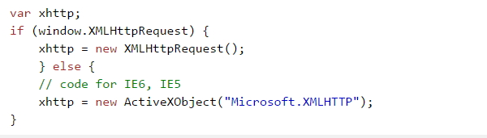

### DAY 26(5/13 Fri)

---

[Ajax의 주요 구성 요소](#ajax의-주요-구성-요소)

[Ajax 방식](#ajax-방식)

[XMLHttpRequest 객체](#xmlhttprequest-객체)

[XMLHttpRequest의 객체 생성](#xmlhttprequest의-객체-생성)

[XMLHttpRequest 객체](#xmlhttprequest-객체)

[Ajax 통신 예제](#ajax-통신-예제)

[JSON](#json)

- [직렬화와 역직렬화](#직렬화와-역직렬화)

- [비동기 통신 예제 JSON 사용](#비동기-통신-예제-json-사용)


13. 드롭다운 리스트 상자에 아이템을 추가,삭제,변경

    ```html
    <!DOCTYPE html>
    <html lang="en">
    <head>
        <meta charset="UTF-8">
        <meta http-equiv="X-UA-Compatible" content="IE=edge">
        <meta name="viewport" content="width=device-width, initial-scale=1.0">
        <title>Document</title>
        <script>
            // 대분류
            let addressList = ["서울","인천","경기도","강원도"];
            
            // 중분류
            let gugunListSeoul = ["노원구", "강남구", "구로구", "마포구"];
            let gugunListIncheon = ["남동구", "부평구", "서구", "계양구"];
            let gugunListKy = ["부천시", "시흥시", "안양시", "수원시"];
            
            window.onload = function(){
                let sido = document.getElementById('sidoSelect');
                for(i=0 ; i < addressList.length; i++){
                    let optionel = document.createElement('option');
                    optionel.value = addressList[i];
                    optionel.appendChild(document.createTextNode(addressList[i]));
                    sido.appendChild(optionel);
                }
    
                let gugun = document.getElementById("gugunSelect");
                let btnArea = document.getElementById("btnArea");
                gugun.style.display = "none";
                btnArea.style.display = "none";
            }
    
            function changeSidoSelect(){
                let sido = document.getElementById("sidoSelect");
                let idx = sido.options.selectedIndex;
                
                let area = document.getElementById("area"); 
                area.value = "";
     
                gugunSelectFill(idx);
            }
    
            function gugunSelectFill(idx){
                let data = null;
                let gugun = document.getElementById('gugunSelect');
                let btnArea = document.getElementById('btnArea');
                if (idx == 0) { 
                    gugun.style.display = "none";  // 중분류 태그 감추기
                    btnArea.style.display = "none";
                    return;
                }
                if (idx == 1){ data = gugunListSeoul }
                if (idx == 2){ data = gugunListIncheon }
                if (idx == 3){ data = gugunListKy }
                
                if (idx == 4){
                    gugun.style.display = "none"; 
                    alert("현재는 지원하지 않습니다.");
                    return; 
                }
                gugun.innerHTML = "";
                gugun.innerHTML = "<option value = ''>중분류를 선택하세요</option>"
               
                for (i =0 ; i<data.length; i++){   
                    // 새로운 <option value=''>값</option> 태그 생성
                    let optionEl = document.createElement("option");
                
                    // value 속성 태그에 저장
                    optionEl.value = data[i];
                    
                    // text 문자열을 새로 생성한 <option> 태그에 추가
                    optionEl.appendChild (document.createTextNode(data[i]));
                    
                    // 만들어진 option 태그를 <select>태그에 추가
                    gugun.appendChild(optionEl);
                }
        
                gugun.style.display = "";                      
                btnArea.style.display = "";  
            }
    
            function getArea(){
                let area = document.getElementById("area"); // 태그 검색
                let sido = document.getElementById("sidoSelect");
                let gugun = document.getElementById("gugunSelect");
                //alert(sido.value + " " + gugun.value); // 선택값의 출력
                
                area.value = sido.value + " " + gugun.value;
         
            }
    
    
    
    
        </script>
    </head>
    <body>
        <div id="sido">
            <select onChange = "changeSidoSelect();" id="sidoSelect">
                <option value="">대분류를 선택하세요.</option>
            </select>
    
            <select name="" id="gugunSelect">
                <option value="">중분류를 선택하세요</option>
            </select>
    
            <label for="">
                <button id = "btnArea" name = "btnArea" onclick = "getArea()">선택</button>
                선택한 지역 : 
                <input type="text" id = "area" size = "40">
            </label>
        </div>
    </body>
    </html>
    ```


##### Ajax의 주요 구성 요소

 - XMLHttpRequest  : 웹서버와 통신을 담당합니다.

   사용자의 요청을 웹서버에 전송하고 웹서버로 부터 받은 결과를 웹
   브라우저에 전달 합니다.
  - XMLHttpRequest외에도 ES6에 추가된 Promise 객체와 ES8에 추가된
      Async, Await등을 이용해서 Ajax 통신을 간편하게 할 수 있다.

  - DOM : 문서의 구조를 나타냅니다. 폼 등의 정보나 화면 구성을 조작할 때 사용 됩니다.

  - CSS : 글자색, 배경색, 위치, 투명도 등 UI와 관련된 부분을 담당합니다.

  - 자바스크립트 : 사용자가 마우스를 드래그하거나 버튼클릭을 하면, 
      XMLHttpRequest, Promise 객체를 사용해서 웹서버에 요청을 전송합니다.  또한 XMLHttpRequest 객체로부터 응답이 오면 DOM, CSS등을 사용해서 화면을 조작합니다.

  


##### Ajax 방식

- 웹 브러우져가 아닌 XMLHttpRequest객체가 웹 서버와 통신을 합니다.

- 페이지 이동 없이 특정 HTML 콘트롤이 웹 서버와 통신을 하여 결과를 
   화면에 출력합니다.

- 웹서버의 응답 결과가 HTML이 아니라 XML 또는 단순 TEXT입니다.




1. 웹 페이지에서 이벤트가 발생합니다 (페이지가 로드되고 버튼이 클릭 됨)

2. XMLHttpRequest 객체는 JavaScript에 의해 생성됩니다.

3. XMLHttpRequest 객체는 웹 서버에 요청을 보낸다.

4. 서버가 요청을 처리합니다.

5. 서버가 웹 페이지에 응답을 보냅니다.

6. JavaScript가 응답을 읽습니다.

7. 적절한 조치 (예 : 페이지 업데이트)가 JavaScript에 의해 수행됩니다.


##### XMLHttpRequest 객체

 \- 대부분의 브러우저가 지원함으로 XMLHttpRequest를 실행하는데 문제가
  없습니다.

 \- XMLHttpRequest 객체는 reload 없이 서버에서 보내는 데이터를 웹페이지의 한부분으로 수정합니다. 

 

 (1) XMLHttpRequest객체의  함수

   \- open() - 요청의 초기화, GET/POST 선택, 접속할 URL입력합니다. 

   \- send() - 웹서버에 요청을 전송합니다. 

 

 

 (2) XMLHttpRequest객체의 속성

   - onreadystatechange - 응답이 도착하면 특정 자바스크립트 함수를 호출해서 결과의 알맞은 작업을 합니다.  그때 사용할 자바스크립트 함수(callback 함수)를 지정합니다.

   - readyState - XMLHttpRequest 객체의 요청에 대한 상태를 숫자로 표시이 상태의 변화(로딩중, 처리중, 처리완료)가 있을때마 XMLHttpRequest 객체의 onreadystatechange속성에 설정된 callback함수가 호출됩니다.

   - status - XMLHttpRequest객체는 웹서버가 전달한  http 상태코드를 status 속성에 저장합니다.

   - responseText/responseXml - 응답의 결과값(텍스트/ XML DOM)을 참조하기 위해서 사용합니다. 


##### XMLHttpRequest의 객체 생성







##### XMLHttpRequest 객체

 1. 서버에 요청을 보내는 메서드

 - open(), send()
 - open(GET/POST,  요청URL, true/false);


 (1) open()에 GET/POST 사용

 - GET 방식은  POST 방식보다 간단하고 빠른 방식. 
 - GET 방식은 요청 URL뒤에 파라메터를 보낸다.


  xhttp.open("GET", "demo_get.jsp?fname=Henry&lname=Ford", true);

  xhttp.send();


 - POST 방식은 서버의 내용을 변경하고자 할때 사용하며, 서버로 보내는
    데이터가 많을때 사용한다.
 - POST방식으로 데이터를 서버로 보낼때는 setRequestHeader()에 Content-type
    명시한다.          

   xhttp.open("POST", "demo_post2.jsp", true);

   xhttp.setRequestHeader("Content-type", "application/x-www-form-urlencoded");

   xhttp.send("fname=Henry&lname=Ford");


 (2) open()에 동기/비동기 사용

  - 자바스크립트는 동기화 방식을 사용한다. 동기화는 요청후 서버의 응답이 있을때까지
      기다렸다가 응답이후에 다음작업을 실행한다.
  - 동기화 방식은 웹 서버의 접속자 폭주로 인한 지연, 통신 상태의 불안정한 상태일때
      응답이 도착하기 까지 빈(흰)화면을 보여준다.


  - 비동기 방식은 요청 후 응답이 도착하는 동안 기다리지 않고 다음작업을 진행한다.
  - 비동기 방식은 Ajax에서 사용한다.


2. onreadystatechange Event


 - onreadystatechange Event는 비동기 상태의 요청에 대한 응답시점을 인식시켜준다.
 - onreadystatechange Event는 callback함수가 연결되어 readystate값이 변경되면 자동으로 callback함수가 호출된다.


 (1) onreadystatechange

 - 이 속성에 연결된 함수는 readyState의 값이 변경 될때 마다 자동 호출된다.
 - 이 속성값을 통해 웹 서버와의 통신 상태를 확인 할 수 있다.

 (2) readyState 
 - 5가지의 요청에 대한 상태를 전달받는다. ( 0 ~ 4 )
 - 0 (UNINITIALIZED) : 객체만 생성되고 초기화 되지 않은 상태

 - 1 (LOADING) : 연결이 시작되었다는 의미이다.

​           open() 호출되고 send() 호출되지 않은 상태 

 

  - 2 (LOADED) : 요청의 시작 

​           send()메소드가 불렸지만 status와 헤더는 도착하지 않은 상태

 

  - 3 (INTERACTIVE) : 서버가 요청처리를 거의 끝난 상태, 데이터의 일부를 받은 상태

 

  - 4 (COMPLETED) : 서버의 응답을 받아 사용할 준비완료, 데이터를 전부받은 상태

 (3)  status 

  - 서버로부터 도착한 응답의 상태값을 나타낸다.

  - 200(OK): 요청 정상 처리

  - 403(Forbidden): 접근 거부

  - 404(Not Found): 페이지 없음

  - 500(Internal Server Error): 서버 오류 발생

 

3. 서버에서 응답을 받는다.
 - XMLHttpRequest object 의 responseText, responseXML 속성을 사용합니다.

.jpg)


##### Ajax 통신 예제

1. Html 파일 비동기 요청

   ```html
   <!DOCTYPE html>
   <html lang="en">
   <head>
       <meta charset="UTF-8">
       <meta http-equiv="X-UA-Compatible" content="IE=edge">
       <meta name="viewport" content="width=device-width, initial-scale=1.0">
       <title>Document</title>
       <script>
           function loadDoc(){
               let xhttp;
               if(window.XMLHttpRequest){
                   xhttp = new XMLHttpRequest();
               } else {
                  // code for IE6, IE5
                   xhttp = ActiveXObject("Microsoft.XMLHTTP");
               } 
               xhttp.onreadystatechange = function(){
                   if (xhttp.readyState == 4 && xhttp.status == 200){
                       alert(xhttp.responseText);
                       document.getElementById("demo").innerHTML = xhttp.responseText;
                   }
               };
    
               xhttp.open("GET","info.html",true);
               xhttp.send();
           }
    
       </script>
   </head>
   <body>
    
       <p id='demo'>Let AJAX change this text.</p>
       <button onclick='loadDoc()'>Change Content</button>
       
   </body>
   </html>
   ```

2. xml 파일 비동기 요청

   ```html
   <!DOCTYPE html>
   <html lang="en">
   <head>
       <meta charset="UTF-8">
       <meta http-equiv="X-UA-Compatible" content="IE=edge">
       <meta name="viewport" content="width=device-width, initial-scale=1.0">
       <title>Document</title>
       <script>
           function loadDoc(){
               let xhttp;
               if(window.XMLHttpRequest){
                   xhttp = new XMLHttpRequest();
               } else {
                  // code for IE6, IE5
                   xhttp = ActiveXObject("Microsoft.XMLHTTP");
               } 
    
               xhttp.onreadystatechange = function(){
                   if (xhttp.readyState == 4 && xhttp.status == 200){
                       xmlDoc = xhttp.responseXML;
                       let txt = '';
                       let x = xmlDoc.getElementsByTagName("ARTIST");
                       console.log(`x : ${x.length}`);
                       for (let i=0; i < x.length ; i++){
                           txt = txt + x[i].childNodes[0].nodeValue + '<br>';
                       }
                       document.getElementById("demo").innerHTML = txt;
                   }else{
                       if (xhttp.readyState != 4 && xhttp.status != 200){
                           alert(xhttp.status)
                       }
                   }
               };
    
               xhttp.open("GET","catalog.xml",true);
               xhttp.send();
           }
    
       </script>
   </head>
   <body>
    
       <p id='demo'>Let AJAX change this text.</p>
       <button onclick='loadDoc()'>Change Content</button>
       
   </body>
   </html>
   ```


#### JSON

: JavaScripyt Object Notation

- 자바 스크립트 객체 표기법

- JSON은 데이터 저장과 교환에서 사용한다.

- XML에 비해서 매우 적은 네트워크 트래픽을 동반하며,  XML을 대체할 수 있는 데이터 표현 기술이다.
- 서버와 데이터를 주고받을때 및 데이터를 직렬화 할때 사용된다.
- key-value 한쌍으로 표현된다.
- 가벼운 텍스트 기반 구조이다.
- 프로그램 언어와 플랫폼에 독립적이다.


##### 직렬화와 역직렬화

- 서버와 클라이언트(브라우저)가 연결하여 데이터를 주고받을때 사용한다.
- ```parse(text:string, reviver?:(this:any, key:string, value:any) => any) : any;``` 
 json 문자열을 어떤 타입의 객체로 변환해준다.
- parse함수의 reviver? 는 callback함수로 사용은 옵션으로 좀더 세밀한 객체로 조정하고 싶을때 쓴다.
- ```stringify(value:any, replacer?:(this:any, key:string,value:any) => any, space?: .... ) : string;```     어떤 타입이든 string 타입으로 변환 해준다.
- stringify함수의 replacer? 는 callback함수로 사용은 옵션으로 좀더 세밀한 문자열로 통제하고 싶을때 쓴다.


(1) 직렬화 Object -> JSON
\- 클라이언트에서 서버로 객체를 전송할때는 JSON의 문자열로 변환해서 보낸다 
\- stringify(obj)
\- 객체안의 메소드는 JSON 문자열로 만들어지지 않는다.

```javascript
//JSON(JavaScript Object Notation)
//1. Object to JSON
//stringify(obj)
let json = JSON.stringify(true); //true -> 문자열
console.log(json);
 
json = JSON.stringify(['apple','banana']); //배열 -> 문자열
console.log(json);
 
const rabbit = {  //객체 -> 문자열, 메서드는 JSON으로 변환되지 않는다.
    name : 'tori',
    color : 'white',
    size : null,
    birthdate : new Date(),
    jump:() => { // JSON에 제외된다.
        console.log(`${name} can jump!`);
    },
};
 
json = JSON.stringify(rabbit);
console.log(json);

//JSON으로 변환시 통제, 두번째 파라메터에서 배열을 넘기면 첫번째 객체에서
//두번째 배열의 내용만 변환
json = JSON.stringify(rabbit,['name','color']);
console.log(json);
 
//JSON으로 변환시 통제, 두번째 파라미터에 함수를 사용한다.
json = JSON.stringify(rabbit, (key, value) => {
    console.log(`key: ${key}, value: ${value}`);
    return key === 'name' ? 'rab' : value;
});
console.log(json);
```


(2) 역직렬화 JSON -> Object , parse(json)
\- 클라이언트가 서버로부터 JSON의 문자열 데이터를 받아서 객체로 변환해서 사용한다.

```javascript
//JSON(JavaScript Object Notation)
//2. JSON to Object
//parse(json)
console.clear();
json = JSON.stringify(rabbit); //object -> JSON
const obj = JSON.parse(json); //JSON -> object
console.log(obj);
rabbit.jump(); 
//obj.jump()// JSON 변환에서는 jump()가 없기때문에
// object로 변환해도 object에 jump()가 없다. 
 
console.log(rabbit.birthdate.getDate());
//JSON으로 변환할때 문자열로 변환되어 object로 파싱될때도 string값을 가진다
//console.log(obj.birthdate.getDate()); 
 
//파싱될때 추가적인 파라미터로 birthdate를 Date객체로 변환하게 할 수 있다.
const obj2 = JSON.parse(json, (key, value) => {
    console.log(`key: ${key}, value: ${value}`);
    return key === 'birthdate' ? new Date(value) : value;
});
console.log(obj2.birthdate.getDate()); 
```


##### 비동기 통신 예제 JSON 사용

(1) parse(), stringify() 확인, typeof(); 타입확인

```html
<!DOCTYPE html>
<html lang="en">
<head>
    <meta charset="UTF-8">
    <meta http-equiv="X-UA-Compatible" content="IE=edge">
    <meta name="viewport" content="width=device-width, initial-scale=1.0">
    <title>Document</title>
</head>
<body>
    <H2>JSON Object Creation in JavaScript</H2>
    <p id='demo'></p>
 
    <script>
        let text = '{"name":"John","street":"Oslo West","phone":"111 11111"}';
        console.log(typeof(text));
        let obj = JSON.parse(text); //문자열을 객체로 변환
        console.log(typeof(obj));
        document.getElementById('demo').innerHTML = 
        obj.name + '<br>' +
        obj.street + '<br>' +
        obj.phone;
 
        let text2 = JSON.stringify(obj); //객체를 문자열로 변환
        console.log(typeof(text2));
 
 
    </script>
</body>
</html>
```


```html
<!DOCTYPE html>
<html lang="en">
<head>
    <meta charset="UTF-8">
    <meta http-equiv="X-UA-Compatible" content="IE=edge">
    <meta name="viewport" content="width=device-width, initial-scale=1.0">
    <title>Document</title>
</head>
<body>
    <p>How to create a JavaScript object array</p>
    <p id='demo'></p>
    <script>
    let emp = [
        {
            "firstName":"John",
            "lastName":"Doe"
        },
        {
            "firstName":"Anna",
            "lastName":"Smith"
        },
        {
            "firstName":"peter",
            "lastName":"Jones"
        }
    ];
 
    console.log(typeof(emp));
    document.getElementById('demo').innerHTML= 
    emp[0].firstName + " " + emp[0].lastName;
    emp[0]["firstName"] +" " + emp[0]["lastName"];
    </script>
</body>
</html>

```


(2) 비동기 통신으로 JSON 응답 받기.

\- 서버를 구현한 jsp는 톰캣이 있어야한다.
\- [톰캣 서버 설정 ](http://lectureblue.pe.kr/reqtiles/read.jsp?bbsno=954&nowPage=1&col=&word=&code=55)
\- VSCode 확장하기

  Debugger for java (Microsoft)

  Tomcat for java (Wei Shen)

 

\- Explorer 하단에 추가된 TOMCAT SERVERS에서 '+' 클릭 후

 톰캣폴더를 추가 한다.

\- 우클릭으로 Open server configration 선택한다.

 <Host name="localhost" 찾아서 아래부분에 다음소스 추가 (d:/aistudy/javascirpt/ajax)

<Context path="" docBase="jsp작업경로"></Context>

```jsp
<%@ page contentType="text/html; charset=UTF-8" %>
{
        "code":"success"
        ,
        "data":{
                "member":
                [
                        {
                        "name":"홍길동",
                        "id":"coder",
                        "sno":"a01"
                        }
                        ,
                        {
                        "name": "아로미",
                        "id": "dev",
                        "sno": "a02"
                        }
                ]
                
              }
    }
```


```html
<!DOCTYPE html>
<html lang="en">
<head>
    <meta charset="UTF-8">
    <meta http-equiv="X-UA-Compatible" content="IE=edge">
    <meta name="viewport" content="width=device-width, initial-scale=1.0">
    <title>Document</title>
    <script>
        function loadDoc(){
            let xhttp;
            if(window.XMLHttpRequest){
                xhttp = new XMLHttpRequest();
            } else {
               // code for IE6, IE5
                xhttp = ActiveXObject("Microsoft.XMLHTTP");
            } 
 
            xhttp.onreadystatechange = function(){
                if (xhttp.readyState == 4 && xhttp.status == 200){
                    //alert(xhttp.responseText);
                    let result = JSON.parse(xhttp.responseText);
                    if(result.code === 'success'){
                        let marr = result.data.member;
                        let tex = '';
                        console.log(marr);
                        document.getElementById('demo').innerHTML="";
                        for(let i=0; i < marr.length; i++){
                             let idx = marr[i]["id"] ;
                             let name = marr[i].name ;
                             let sno = marr[i].sno ;
                             let txt = idx + " [" + name + "] " + sno + ", ";
                             
                             document.getElementById("demo").append(txt);
                             
                        } 
                    }
                    
                }else{
                    
                   // alert(xhttp.status)
                  
                }
            };
 
            xhttp.open("GET","member.jsp",true);
            xhttp.send();
        }
 
    </script>
</head>
<body>
 
    <p id='demo'>Let AJAX change this text.</p>
    <button onclick='loadDoc()'>Change Content</button>
    
</body>
</html>

```


(3) XHR의 onload, onerror 사용


```html
<!DOCTYPE html>
<html lang="en">
<head>
    <meta charset="UTF-8">
    <meta http-equiv="X-UA-Compatible" content="IE=edge">
    <meta name="viewport" content="width=device-width, initial-scale=1.0">
    <title>Document</title>
    <script>
 
        function loadDoc(){
            let xhttp;
            if(window.XMLHttpRequest){
                xhttp = new XMLHttpRequest();
            } else {
               // code for IE6, IE5
                xhttp = ActiveXObject("Microsoft.XMLHTTP");
            } 
 
            xhttp.onload = onLoadListener;
            xhttp.onerror = onErrorListener;
            // xhttp.addEventListener("error", onErrorListener);
                
            xhttp.open("GET","member.jsp",true);
            xhttp.send();
 
        }
        function onLoadListener(){
            let result = JSON.parse(this.responseText);
            if(result.code === 'success'){
                let marr = result.data.member;
                let tex = '';
                console.log(marr);
                document.getElementById('demo').innerHTML="";
                for(let i=0; i<marr.length; i++){
                    let idx = marr[i]["id"] ;
                    let name = marr[i].name ;
                    let sno = marr[i].sno ;
                    let txt = idx + " [" + name + "] " + sno + ", ";
                    
                    document.getElementById("demo").append(txt);
                        
                } 
            }
        }
 
        function onErrorListener(err){
            console.log('XHR Error : ',err);
        }
 
 
 
    </script>
</head>
<body>
 
    <p id='demo'>Let AJAX change this text.</p>
    <button onclick='loadDoc()'>Change Content</button>
    
</body>
</html>
```


