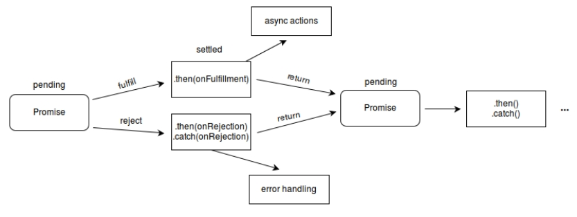

### DAY27(5/16 Mon)

---


#### CallBack 함수의 개선

---

##### Promise 사용

- 참조사이트 : [MDN Web Docs](https://developer.mozilla.org/ko/docs/Web/JavaScript/Reference/Global_Objects/Promise)

- Promise 객체는 자바스크립트에서 제공하며, 비동기를 간편하게 처리할 수 있도록 도와준다.
- 정해진 장시간의 기능을 수행 후 정상적인 수행 완료 또는 실패와 그 결과 값을 전달한다.
- javascrit의 클래스로 생성자를 통해서 객체를 만든다.

- 비동기 연산이 종료 후의 결과값이나 실패 이유를 처리하기 위한 처리기를 연결할 수 있다. 

- 프로미스를 사용하면 비동기 메서드에서 마치 동기 메서드처럼 값을 반환할 수 있다. 

- 최종 결과를 반환하지는 않고, 대신 프로미스를 반환해서 미래의 어떤 시점에 결과를 제공한다.

- Promise는 다음 중 하나의 상태를 가집니다.

 대기(pending) : 이행하거나 거부되지 않은 초기 상태.

 이행(fulfilled) : 연산이 성공적으로 완료됨.

 거부(rejected) : 연산이 실패함.

 

- 대기 중인 프로미스는 값과 함께 이행할 수도, 어떤 이유(오류)로 인해 거부될 수 있다.
- 이행이나 거부될 때, 프로미스에 연결한 처리기는 그 프로미스의 then 메서드로 대기열에 오른다.




(1) Promise 생성, 사용

 **const promise = new Promise((resolve, reject) =>{ 

  });**

- Promise 생성자에서 excutor 콜백함수는 또다른 resolve(정상수행 후 결과전달), reject(문제가 생기면 호출) 
 콜백함수를 받는다.
- Promise는 시간이 걸리는 비동기 처리를 구현할 수 있다.
- **Promise를 생성하면 executor 콜백함수가 자동으로 실행된다. (※)**
- Promise를 생성하여 비동기 처리를 구현 후 resolve(), reject() 콜백 함수를 호출하여 그결과를 전달한다.
- Promise 사용하는 곳에서 결과를 then, catch, finally 등으로 받을 수 있다.


```javascript
'use strict';
//Promise is a JavaScript object for asynchronous operation.
//State : pending -> fulfilled or rejected
//Producer vs Consumer
 
//1. Producer:제공자
// when new Promise is created, the executor runs automatically.
 
const promise = new Promise((resolve, reject)=>{
    //doing some heavy work(network, read files)
    console.log('doing something...');
    setTimeout(() => {
        resolve('study');
        //reject(new Error('no network'));
    }, 2000)
});
 
//2. Consumers : 사용자 , then, catch, finally
promise //
    .then((value)=>{ // value는 promise가 잘 처리되어 resolve호출하고 거기에 전달된 'study' 를 받는다.
        console.log(value);
    })
    .catch(error => { //error는 promise가 처리되다 오류가 발생하여 전될되는 Error객체를 받는다. 
        console.log(error);
    })
    .finally(() => { //무조건 실행되는 곳
        console.log('finally')
    });

```


(2) Promise chaning, error 처리
- Promise chaning, Promise error 예제 확인
- then은 값 또는 Promise 객체가 전달된다.

```javascript
//3. Promise chaining
const fetchNumber = new Promise((resolve, reject) => {
    setTimeout(() => resolve(1), 1000);
});
fetchNumber
    .then(num => num * 2)
    .then(num => num * 3)
    .then(num => {
        return new Promise((resolve, reject) => {
            setTimeout(() => resolve(num - 1), 1000);
        });
    })
    .then(num => console.log(num));
 
//4. Error Handling
const getHen = () =>
    new Promise((resolve, reject) => {
        setTimeout(() => resolve('hen'),1000);
    });
 
const getEgg = hen =>
    new Promise((resolve, reject) => {
       setTimeout(() => resolve(`${hen} => egg`),1000);
       //setTimeout(() => reject(new Error(`error! ${hen} => egg`)),1000);
    });
 
const cook = egg =>
    new Promise((resolve, reject) => {
        setTimeout(() => resolve(`${egg} => brunch`),1000);
    });
 
getHen() 
    .then(hen => getEgg(hen))
    .then(egg => cook(egg))
    .then(meal => console.log(meal))
    .then(err => console.log(err)); //getEgg 에서 에러 처리, 오류난 부분에서 catch부분으로 건너띈다. 
// 받아온 값 하나를 => 함수에 파라메터로 보낼때 간단히 표현방법.
// 간단히
// getHen() 
//     .then(getEgg)
//     .then(cook)
//     .then(console.log)  
//     .catch(console.log); 
 
// 중간에 오류처리하는 방법, 계란을 받아오다가 오류가 나면 다른재료로 대체한다.
// getHen() 
//     .then(getEgg) 
//     .catch(error => {
//         return 'bread';
//     })
//     .then(cook) 
//     .then(console.log)
//     .catch(console.log);
```
