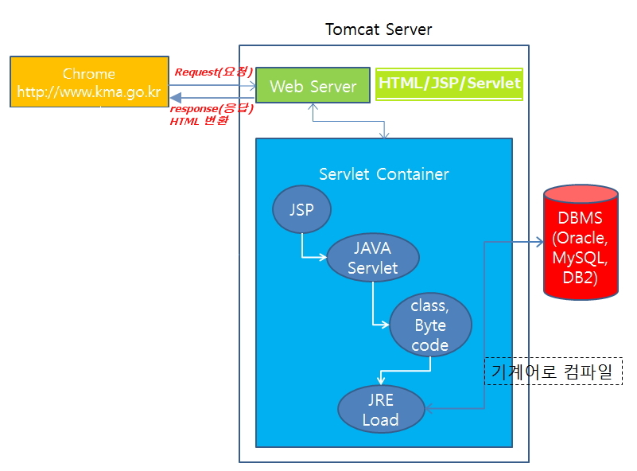
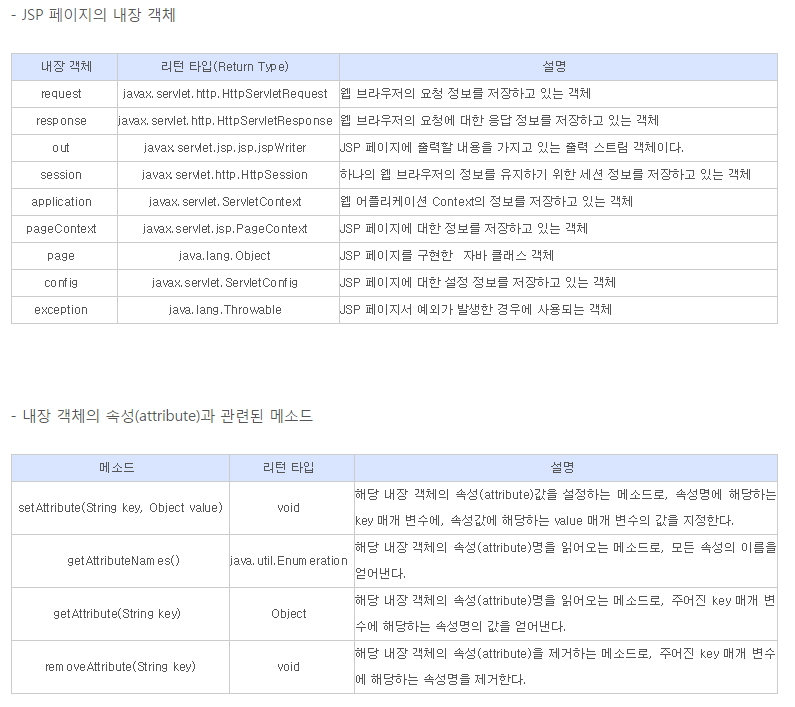
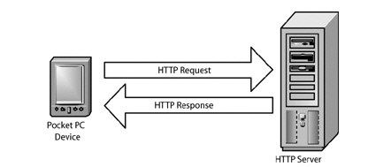
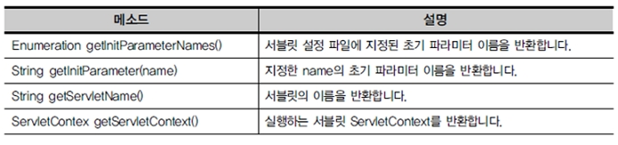

### DAY31(5/20 Fri)

---

[]()

[]()

[]()


#### JSP

---

##### 인터넷 프로그래밍 개요




##### JSP 기초문법

\1. 스크립틀릿의 이해

 \- 일반적인 java 코드가 쓰임: <% ... JAVA 코드 명시 ... %>

```jsp
<%@ page language="java" contentType="text/html; charset=UTF-8"
    pageEncoding="UTF-8"%>
<!DOCTYPE html>
<html>
<head>
<meta charset="UTF-8">
<title>Insert title here</title>
</head>
<body>
<%
String name = "왕눈이";
int kuk = 90;
int eng = 95;
int tot = kuk + eng;
int avg = tot / 2;
%>
 
<h1>성적표</h1>
<div style='font-size: 24px;'>
  -------------------------<br>
  성명: <% out.println(name); %><br>
  국어: <% out.println(kuk); %><br>
  영어: <% out.println(eng); %><br>
  총점: <%=tot %><br> 
  평균: <%=avg %><br>
</div>
 
<%
// System.out.println(">>>>> name: " + name);
%>
</body>
</html>
```


\2. 선언문(특별한 경우만 사용, 빈즈로 대체하여 사용함으로 권장하지 않음)

 \- 메소드(함수) 선언: <%! ...JAVA 메소드... %>

```
<%@ page language="java" contentType="text/html; charset=UTF-8"
    pageEncoding="UTF-8"%>
<!DOCTYPE html>
<html>
<head>
<meta charset="UTF-8">
<title>Insert title here</title>
</head>
<body>
<%!
public int tot(int kuk, int eng, int mat){
  return kuk+eng+mat;
}
 
public int avg(int tot){
  return tot/3;
}
%>
 
<%
String name = "아로미";
int kuk = 90;
int eng = 85;
int mat = 100;
int tot = tot(kuk, eng, mat);
int avg = avg(tot);
%>
<h1>성적표</h1>
<ul style='font-size: 24px;'>
  <li> 성명: <%=name %>
  <li> 국어: <%=kuk %>
  <li> 영어: <%=eng %>
  <li> 수학: <%=mat %>
  <li> 총점: <%=tot %>
  <li> 평균: <%=avg %>
</ul>
</body>
</html>
```


\3. 표현식(Expression) 

 \- 단순 출력 기능.

 \- <% System.out.print(hap(10, 20)); %> 콘솔에 출력 

 \- <% out.print(hap(10, 20)); %>      JSP 출력
 \- <%=hap(10, 20)%> JSP 출력, 문장 종결자(';')을 사용할 수 없고,
   오로지 하나의 값만 출력


\4. 주석

  \- <% 

​    //       

​    /*...~~~...*/ 

   %>

```
<%@ page language="java" contentType="text/html; charset=UTF-8"
pageEncoding="UTF-8"%>
<!DOCTYPE html>
<html>
<head>
<meta charset="UTF-8">
<title>JSP스크립트 Example</title>
</head>
<body>
<h1>Script Example1</h1>
<%!String declaration = "Declaration";%>
<%!public String decMethod() {
 
         return declaration;
       }%>
<%
String scriptlet = "Scriptlet";
String comment = "Comment";
 
out.println("내장객체를 이용한 출력 : " + declaration + "<p/>");
%>
 
선언문의 출력1 :
<%=declaration%><p />
선언문의 출력2 :
<%=decMethod()%><p />
스크립트릿의 출력 :
<%=scriptlet%><p />
<!--JSP주석부분-->
<!-- JSP 주석1 :  <%=comment%> -->
<p />
<%-- JSP 주석2 : <%=comment%> --%>
<%
/* 주석 
  (여러줄 주석)
   */
%>
<%
// 주석(한줄 주석)
%>
</body>
</html>
```


\5. [실습] 이미지 목록을 배열에 저장한 후 출력하는 스크립트를 작성

\- for문을 이용할 것.

\- 다운받은 tulip 압축파일을 tulip폴더에 압축을 풀어 WebContent로 저장후 실행

```
<%@ page language="java" contentType="text/html; charset=UTF-8"
pageEncoding="UTF-8"%>
<!DOCTYPE html>
<html>
<head>
<meta charset="UTF-8">
<title>Insert title here</title>
</head>
<body>
<%
String root = request.getContextPath();
// 이미지 목록을 배열에 저장
String[] images = { "tu01.jpg", "tu02.jpg", "tu03.jpg", "tu04.jpg", "tu05.jpg", "tu06.jpg", "tu07.jpg", "tu08.jpg",
    "tu09.jpg", "tu10.jpg" };
 
out.println("<h1>튜울립 축제</h1><br>");
for (int i = 0; i < images.length; i++) {
  out.println("<a href='" + root + "/tulip/" + images[i] + "'>");
  out.println("");
  out.println("</a>");
}
%>
</body>
</html>
```


##### JSP 지시자와 액션태그

1. JSP 지시자(Directive)
   \- 지시자는 클라이언트의 요청에 JSP 페이지가 실행이 될 때 필요한 정보를
    JSP 컨테이너에게 알리는 역할한다.
   \- 지시자는 태그 안에서 @으로 시작하며, 3가지 종류가 있다.
    page, include, taglib

(1)page 지시자
 \- jsp페이지에서 지원되는 속성들을 정의하는 것들이다.
 \- jsp페이지에서 JSP컨테이너에게 해당 페이지를 어떻게 처리할 것인가에
 대한 페이지 정보를 알려준다.


■ info : 페이지설명, jsp 페이지 제목을 붙이는 것과 같다.
■ language : Jsp페이지의 스크립트 언어지정 기본값은 Java
■ contentType: jsp의 출력 형식 지정, 문자 셋을 지정합니다. 

 \- 형식: contentType="text/html; charset=UTF-8" 

 <%@ page contentType="text/html; charset=UTF-8" %> 

 \- JSP처리 결과가 HTML임으로 MIME Type을 'text/html'과 문자 코드(UTF-8)
  선언. 

 \- MIME Type: 브러우저가 출력하는 데이터의 종류를 나타낸 코드값, 

 예) image/jpg는 이미지가 출력됨 

 \- HTML 태그의 META태그도 일치시켜야함(브러우저용). 

 <meta http-equiv="Content-Type" content="text/html; charset=UTF-8"> 

 <meta http-equiv="Content-Type" content="text/html; charset=EUC-KR"> 

 

■ import: 패키지의 import, 중복 사용가능 

  자바에서 패키지를 사용하겠다고 선언하는 것과 같다

  예) <%@ page import="java.util.*" %>

■pageEncoding: jsp1.2에 추가된 규약으로 jsp페이지의 문자셋 형식을 

 지정

 <%@ page pageEncoding="UTF-8" contentType="text/html" %> 


```
<%@ page language="java" contentType="text/html; charset=UTF-8"
        pageEncoding="UTF-8"%>
<%@ page import="java.util.Date"%>
<!DOCTYPE html>
<html>
<head>
<meta charset="UTF-8">
<title>Insert title here</title>
</head>
<body>
        <div
                style='font-size: 36px; color: #FFFFFF; background-color: #FF3399;'>
                <%
                Date date = new Date(); // Date cannot be resolved to a type 
                out.println(date.toLocaleString());
                %>
        </div>
</body>
</html>
```


(2) include 지시자
 \- 여러 jsp페이지에서 공통적으로 포함하는 내용이 있을 때 이러한 내용을
  매번 입력하지 않고 파일에 저장한 후 JSP파일에 포함해서 실행한다.

 \- 처리 결과가 합쳐지는 것이 아니라 파일의 소스가 하나의 파일에 합쳐진
  다음 실행된다. 

 

  list.jsp 소스 + ssi.jsp 소스 = jsp 통합 큰 소스 ==> 실행 

  \-------------------------------------------------------------  

 \- 사용 방법 

 <%@ include file="Local URL" %> 

 <%@ include file="./ssi.jsp" %> 

```
<%@page contentType="text/html;charset=UTF-8"%>
<html>
<body>
include 지시자의 Top 부분입니다.
<hr/>

>>> bottom.jsp
<%@page import="java.util.*"%>
<%@page contentType="text/html;charset=UTF-8"%>
<%
    Date date = new Date();
%>
<hr/>
include 지시자의 Bottom 부분입니다.<p/>
<%=date.toLocaleString()%>
</body>
</html>
```

```
<%@page contentType="text/html;charset=UTF-8"%>
<h1>Directive Example4</h1>
<%@include file="top.jsp"%>
include지시자의 Body 부분입니다.
<%@include file="bottom.jsp"%>
```


2. 액션태그
   \- JSP 문법이다.
   \- 액션태그의 종류는 include, forward, useBean, setProperty, getProperty
    등이 있다.
   ■ useBean, setProperty, getProperty
   \- 자바빈즈(JavaBeans)와 통신을 위해서 구현한 액션태그이다.

​		■ forward
​	  \- 다른페이지로 이동할 때 사용하는 태그이다.

```
<html>
<head>
<meta http-equiv="Content-Type" content="text/html; charset=UTF-8"/>
</head>
<body>
<h1>Forward Tag Example1</h1>
<form method=post action="forwardTag1_1.jsp">
아이디 : <input name="id"><p/>
패스워드 : <input type="password" name="pwd"><p/>
<input type="submit" value="보내기">
</form>
</body>
</html>
```

````
<%@page contentType="text/html;charset=UTF-8"%>
<%
           request.setCharacterEncoding("UTF-8");
%>
<html>
<body>
<h1>Forward Tag Example1</h1>
Forward Tag의 포워딩 되기 전의 페이지입니다.
<jsp:forward page="forwardTag1_2.jsp" />
</body>
</html>
```

```
<%@page contentType="text/html;charset=UTF-8"%>
<%
        String id = request.getParameter("id");
        String pwd = request.getParameter("pwd");
%>
<h1>Forward Tag Example1</h1>
당신의 아이디는<b><%=id%></b>이고<p/>
패스워드는 <b><%=pwd%></b> 입니다.
```


3. Include 액션태그

   ex) <jsp:include page="/menu/top.jsp" flush="false"/>

   top.jsp가 처리가 되고 나서 HTML로 변경된 결과가 포함.


\- include 액션태그는 include 지시자 처럼 다른페이지를 현재 페이지에 포함시킬 수
  있는 기능을 가진다.

\- include 액션태그는 include 지시자와 다르게 포함시킬 페이지의 처리결과를 포함한다.
\- include 액션태그의 flush 속성은 포함될 페이지로 이동할 때 현재 페이지가 지금까지 출력버퍼에 저장한 결과를 어떻게 처리할 것인가를 결정한다.
\- flush = 'true' 이면 포함할 페이지의 내용을 삽입하기 이전에 현재 페이지가 지금까지 버퍼에 저장한 내용을 출력한다.


##### JSP 내부객체



 \1. JSP 내부객체의 이해

\- 개발자가 객체를 생성하지 않아도 jsp페이지가 서블릿 컨테이너(Tomcat)로 

 로딩되면 Tomcat등 서버가 자동으로 생성하는 객체이다. 

\- 개발자는 반복적인 작업을 줄이고 필요한 작업만 할수 있다. 

\- jsp페이지는 Web서버 및 Servlet Container라고 하는 복잡한 환경에서 실행이 

 되기 때문에, 실행중에 여러가지 상태정보를 가지고 있어야 하는데, 

 이런 경우에 사용되는 객체들이 내부 객체들이다. 

\- 내부 객체로 인해 개발자는 좀더 쉽게 JSP 프로그래밍이 가능함. 


(1) request, response, out 
\- 클라이언트로 부터 jsp 페이지의 호출에 의해서 전달되는 데이터 요청과 응답,
 출력의 역할을 한다.

■ request 내부 객체 



\- javax.servlet.http.HttpServletRequest Interface를 Tomcat등 서버가 구현한 객체, 
  자동화된 객체, 개발자는 사용만함. 
 \- <FORM>에서 입력되어 브러우저가 전송한 데이터를 Tomcat 서버의 JSP에서 처리할수 있도록 객체로 가져오는 역할을 한다 
 \- ? : 파라메터를 보낸다는 뜻
 \- &: 접속자가 보내는 값이 2개 이상인 경우


```
<%@ page contentType="text/html; charset=UTF-8" %> 
 
<!DOCTYPE html> 
<html> 
<head>
  <title>homepage</title>
  <meta charset="utf-8">
</head>
<body> 
<div style='font-size: 28px'>
  1. <%=request.getRequestURL() %><br>
  2. <%=request.getRequestURI() %><br>
  3. 사용자로부터 입력을 받을 경우<br>
      급여: <%=request.getParameter("pay") %><br> 
  4. 사용자로부터 입력값이 여러개인 경우<br>
      급여: <%=request.getParameter("pay") %><br>
      성명: <%=request.getParameter("name") %><br>
  <%   
  int java = Integer.parseInt(request.getParameter("java"));
  int jsp = Integer.parseInt(request.getParameter("jsp"));
  int spring = Integer.parseInt(request.getParameter("spring"));
  int tot = java+jsp+spring;
  int avg = tot / 3;
  %>
      JAVA: <%=java %><br>
      JSP: <%=jsp %><br>
      Spring: <%=spring %><br>
      총점: <%=tot %><br>
      평균: <%=avg %><br>
</div>
</body> 
</html> 
```


\- 접속한 클라이언트에 대한 정보도 알 수 있다. 
\- 웹브라우저와 웹 서버의 정보 반환

```
<%@ page contentType="text/html;charset=UTF-8"%>
<%
       String protocol = request.getProtocol();
       String serverName = request.getServerName();
        int serverPort = request.getServerPort();
        String remoteAddr = request.getRemoteAddr();
        String remoteHost = request.getRemoteHost();
        String method = request.getMethod();
        StringBuffer requestURL = request.getRequestURL();
        String requestURI = request.getRequestURI();
        String useBrowser = request.getHeader("User-Agent");
        String fileType = request.getHeader("Accept");
%>
<h1>Request Example2</h1>
프로토콜 : <%=protocol%><p/>
서버의 이름 : <%=serverName%><p/>
서버의 포트 번호 :<%=serverPort%><p/>
사용자 컴퓨터의 주소 : <%=remoteAddr%><p/>
사용자 컴퓨터의 이름 : <%=remoteHost%><p/>
사용 method : <%=method%><p/>
요청 경로(URL) : <%=requestURL%><p/>
요청 경로(URI) : <%=requestURI%><p/>
현재 사용하는 브라우저 : <%=useBrowser%><p/>
브라우저가 지원하는 file의 type : <%=fileType%><p/>
```


■ response내부 객체 

\- javax.servlet.http.HttpServletResponse Interface를 Tomcat등 

 서버가 구현한 객체, 자동화된 객체, 개발자는 사용만함. 

\- 처리 결과를 클라이언트(웹 브러우저)에게 출력할 목적을 가지고 있다. 

\- out 객체는 response 객체로부터 생성한다.

\- sendRedirect(): 데이터 처리를 한후 특정 페이지로 자동으로 주소 이동. 

 요청자체가 새로운 요청으로 바뀐다.
\- 기상청으로 이동: http://www.kma.go.kr 

```
<%@ page language="java" contentType="text/html; charset=UTF-8"
    pageEncoding="UTF-8"%>
<!DOCTYPE html>
<html>
<head>
<meta charset="UTF-8">
<title>Insert title here</title>
</head>
<body>
<% 
response.sendRedirect("http://www.kma.go.kr"); 
%>
</body>
</html>
```


■ out 내부 객체 
\- jsp페이지 결과를 클라이언트에 전송해 주는 출력 스트림을 나타낸다.
\- javax.servlet.jsp.JspWriter Class의 객체 

\- out 객체는 response객체에서 생성된다. 

\- out.print("접속에 성공했습니다.")  

 HTML이 모두 한줄로 생성됨, 소스 분석 어려움 

\- out.println("접속에 성공했습니다.") 

 호출될 때마다 HTML코드를 생성하고 새로운 라인으로 이동함. 

\- System.out.print(), System.out.println()은 디버깅 정보를 콘솔창에

 출력하는 용도로 사용

 (변수의 변화를 추적하기 위한 용도, 관리, 에러 수정목적) 


```
<%@ page contentType="text/html;charset=UTF-8"
         buffer="5kb"
%>
<%
int totalBuffer = out.getBufferSize();
int remainBuffer = out.getRemaining();
int useBuffer = totalBuffer - remainBuffer;
%>
<h1>Out Example1</h1>
<b>현재 페이지의 Buffer 상태</b><p/>
출력 Buffer의 전체 크기 : <%=totalBuffer%>byte<p/>
남은 Buffer의 크기 : <%=remainBuffer%>byte<p/>
현재 Buffer의 사용량 : <%=useBuffer%>byte<p/>
```


(2) session, application, pageContext
\- 실행되는 페이징지의 외부환경정보(context)와 관련된 내부 객체들이다.
\- session은 요청에 관한 Context를 제공한다.
\- application은 서블릿 Context를 제공한다. 
\- pageContext는 jsp 페이지 자체의 Context를 제공한다.


■ session 
\- 세션은 요청을 시도한 특정클라이언트와 다른 클라이언트와 구별하여
 각각의 클라이언트에 대한 정보를 지속적으로 관리할 수 있다.


```
<!--session.html-->
<html>
<head>
<meta http-equiv="Content-Type" content="text/html; charset=UTF-8"/>
</head>
<body>
<h1>Session Example1</h1>
 <form method="post" action="session.jsp">
 아이디 : <input name="id"><p>
 비밀번호 : <input type="password" name="pwd"><p/>
<input type="submit" value="로그인">
</form>
</body>
</html>
```


```
/*session.jsp */
<%@ page contentType="text/html;charset=UTF-8"
         session="true"
%>
<%
  request.setCharacterEncoding("UTF-8");
 
  String id = request.getParameter("id");
  String pwd = request.getParameter("pwd");
 
      session.setAttribute("idKey",id);
      session.setMaxInactiveInterval(60*5); //5분후 연결종료
%>
<h1>Session Example1</h1>
<form method="post" action="session_1.jsp">
    1.가장 좋아하는 계절은?<br/>
<input type="radio" name="season" value="봄">봄
<input type="radio" name="season" value="여름">여름
<input type="radio" name="season" value="가을">가을
<input type="radio" name="season" value="겨울">겨울<p/>
 
2.가장 좋아하는 과일은?<br/>
<input type="radio" name="fruit" value="watermelon">수박
<input type="radio" name="fruit" value="melon">멜론
<input type="radio" name="fruit" value="apple">사과
<input type="radio" name="fruit" value="orange">오렌지<p/>
<input type="submit" value="결과보기">
</form>
```


```
/*session_1.jsp*/

<%@ page contentType="text/html;charset=UTF-8"%>
<%
           request.setCharacterEncoding("UTF-8");
 
                String season = request.getParameter("season");
                String fruit = request.getParameter("fruit");
                String id = (String)session.getAttribute("idKey");    
                String sessionId = session.getId();
                int intervalTime = session.getMaxInactiveInterval();
 
                if(id != null){
%>
<h1>Session Example1</h1>
<b><%=id%></b>님이 좋아하시는 계절과 과일은<p/>  
<b><%=season%></b>과 <b><%=fruit%></b> 입니다.<p/>
세션 ID : <%=sessionId%><p>
세션 유지 시간 : <%=intervalTime%>초<p/>
<%
         session.invalidate();
        }else{
         out.println("세션의 시간이 경과를 하였거나 다른 이유로 연결을 할 수가 없습니다.");
    }
%>
```


■ application
\- 서블릿 또는 어플리케이션 외부 환경 정보(contenxt)를 나타낸다
\- 서버의 정보와 서버측 자원에 대한 정보를 얻을 수 있다.

\- javax.servlet.ServletContext 인터페이스의 구현 객체 

\- 서블릿이 서블릿 컨테이너(Tomcat)에서 실행 될 때의 환경 정보를 저장 

\- 절대 경로 추출시 JSP 형식 

  String upDir = "/pds/storage"; 

  upDir = application.getRealPath(upDir); 

```
<%@ page contentType="text/html;charset=UTF-8"%>
<%
String serverInfo = application.getServerInfo();
String mimeType = application.getMimeType("request1.html");
String realPath = application.getRealPath("/");
application.log("application 내부 객체 로그 테스트");
%>
<h1>Application Example1</h1>
서블릿 컨테이너의 이름과 버전 :<%=serverInfo%><p />
request1.html의 MIME Type :<%=mimeType%><p />
로컬 파일 시스템 경로 :<%=realPath%>
```


■ pageContext
\- Jsp페이지의 Context를 나타낸다.
\- pageContext 내부객체를 통해서 다른 내부객체를 접근할 수 있다.
\- out내부객체 가져오는 방법
 JspWriter pageOut = pageContext.getOut();
\- javax.servlet.jsp.PageContext 클래스 타입으로 제공된다.

.jpg)


(3) page, config
\- page 내부객체와 config내부객체를 통해서 jsp페이지가 변환된 서블릿관 관련되
 내용에 접근할 수 있도록 하는 객체들이다.
■ page
\- Jsp페이지 그 자체를 나타내는 객체이다.
\- Jsp페이지에서 page객체는 this 키워드로 자기 자신을 참조한다.

```
<%@ page info = "study.co.kr"
    contentType="text/html;charset=UTF-8"%>
<% 
       String pageInfo = this.getServletInfo();
%>
<h1>Page Example1</h1>
현재 페이지의 info값 : <%=pageInfo%>
```


■ config
\- javax.servlet.ServletConfig 클래스 타입의 내부 객체이다.
\- 서블릿이 초기화될 때 참조해야 할 다른 여러 정보를 가지고 있다가
 전해준다.




(4) exception 내부객체
\- Jsp 페이지에서 발생한 예외를 처리하는 페이지를 지정한 경우 에러페이지에
 전달되는 예외 객체이다.
\- page지시자 isErrorPage속성을 true로 지정한 Jsp페이지에서만 사용가능하다.

```
<%@ page contentType="text/html;charset=UTF-8"
         errorPage="exception2.jsp"
%>
<%
  int one  = 1;
  int zero = 0;
%>
<h1>Exception Example1</h1>
one / zero = <%=one/zero%><p/>
```

```
<%@ page contentType="text/html;charset=UTF-8"
                    isErrorPage="true"
%>
<%
   String message = exception.getMessage();
   String objectMessage = exception.toString();
%>
에러 메세지 : <b><%=message%></b><p/>
에러 실체의 클래스명과 에러 메세지  : <b><%=objectMessage%></b><p/>
```


