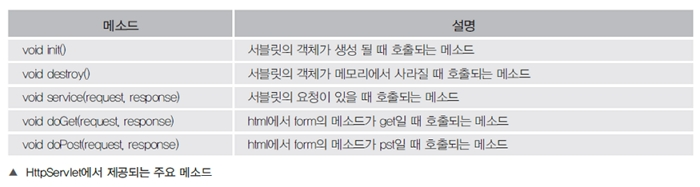
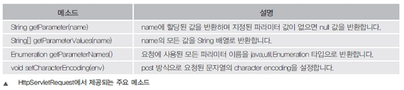
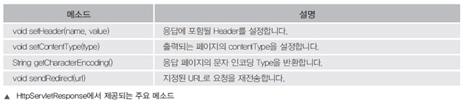
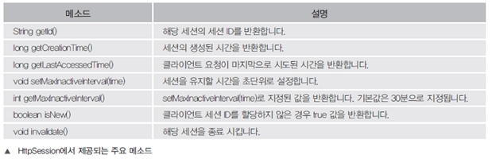
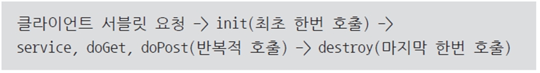
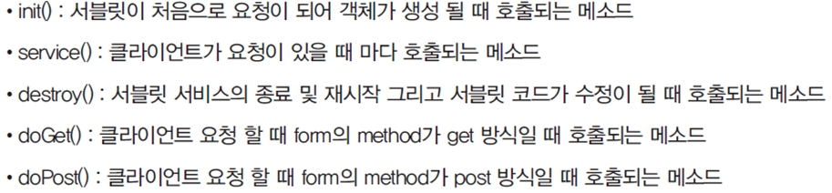

### DAY32(5/24 Tue)

---

##### 서블릿 기초 문법

\1. 서블릿이란
\- Jsp가 나오기전에 만들어진 웹페이지 생성 기술
\- 서블릿은 java의 많은 장점들을 사용 할 수 있지만 html, css, js 등과
 연동하기에 많은 단점이 있다
\- 기업에서 사용하는 프레임워크의 기초 기술로 사용된다.
\- WAS(tomcat)에서 웹페이지를 동적으로 생성하여 결과를 전송해 주는
 서버 측 프로그램이다.

(1) 서블릿의 주요 클래스
■HttpServlet
\- 서블릿을 만들기 위해서 반드시 상속해야 할 필수 클래스스
\- Servlet 인터페이스 > GenericServlet 추상클래스 > HttpServlet 상속구조
\- 위에서 제공되는 많은 메소드사용 가능

■HttpServletRequest
\- 클라이언트가 데이터를 입력하거나 클라이언트의 정보에 대한 요청 값을 가지고 있다.

■HttpServletResponse
\- 클라이언트가 요청한 정보를 처리하고 응답을 위한 정보를 담고 있다.

■HttpSession
클라이언트가 세션정보를 저장하고, 세션 기능을 유지 하기 위해서 제공된다.

(2) 서블릿의 라이프 사이클

\2. 서블릿의 요청 방식
\- 브라우저에서 페이지 간에 통신 할 수 있는 대표적인 방법은 form에서 제공되는
 get방식과 post방식이 있다.

(1) get방식
\- 검색이나 조건을 다른 페이지로 전송할 때 사용
\- 요청시 url에 노출 되는 특징이 있있다.(보안적인 내용은 사용안함)

(2) post방식
\- 게시판에 글을 입력하거나 또는 회원가입을 하는 기능으로 다른 페이지로 전송할 때
 사용하는 방식이다.
\- url에 노출되지 않고 html 헤더 값에 같이 전송된다.
\- 일반적으로 DB 연동을 한다면 insert, update, update 이런 쿼리문을 실행할 때 사용되는 방식이다.