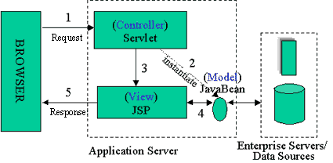
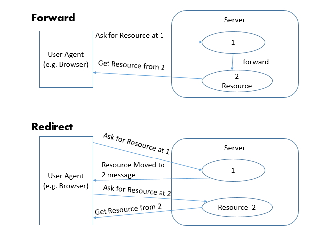
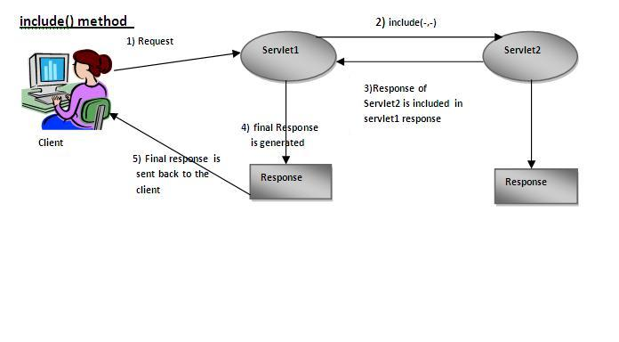

### DAY 37(5/31 Tue)

---

[Spring MVC](#spring-mvc)

- [Controller의 처리 순서](#controller의-처리-순서)

- [Command Pattern에 기반한 Controller 처리순서](#command-pattern에-기반한-controller-처리순서)

- [MVC Web Application 개발 순서](#mvc-web-application-개발-순서)
- [다른 페이지 요청](#다른-페이지-요청)

#### Spring MVC

###### Controller의 처리 순서

Browser --> Controller

1. HTTP 요청을 받음. init(), service(), doGet(),doPost()메소드 자동 호출
2. 클라이언트가 요구하는 기능을 분석
3. 요청한 비즈니스 로직을 처리하는 Model 사용
4. 결과를 request 또는 session에 setAttribute()메소드를 사용하여 저장
5. 알맞은 View 선택
6. View로 forwarding(혹은 redirect) --> .jsp 페이지로 이동

--> JSP --> HTTP 응답 --> Browser

###### Command Pattern에 기반한 Controller 처리순서

- Command Handler
  - Interface, 추상 클래스의 형태
  - JSP Beans, EJB(Enterprise Java Beans)를 통해서 Command Handler를 구현한다.

Browser --> Controller

1. HTTP 요청을 받음
2. 클라이언트가 요구하는 기능을 분석
3. 로직을 처리할 명령어 핸들러 생성(Command Handler)
4. 명령어 핸들러를 이용해 로직 처리(Class 이용)

--> 결과 저장 --> View 리턴

5. 명령어 핸들러가 리턴한 View로 forwarding(or redirect)

--> JSP --> HTTP 응답 --> Browser

###### MVC Web Application 개발 순서

 ① DBMS 설정 
  ② DTO(Data Transfer Object) Class 제작 
  ③ DAO(Data Access Object) Class 제작 
  ④ Service Class 제작 
  ⑤ Service/DAO test 
  ⑥ Servlet Controller 제작 
  ⑦ Action Interface 제작 
  ⑧ Action 구현 Class 제작 
   . Service Class 연동 

  ⑨ JSP 생성 연동 

###### 다른 페이지 요청

(1) `<jsp:forward page = ""/>`

\- 기존요청에 대신 응답으로 다른페이지로 이동합니다.
 \- 기존의 request객체가 살아있으므로 그영역의 저장된 모든 데이타는
  유지됩니다.

(2) `response.sendRedirect();`

\-  재요청에 대한 응답으로  다른 페이지로 이동합니다.
 \-  새로운 request객체가 생성되므로  기존 request영역에 저장된 모든 
   데이타가 없어집니다.

(3) `<jsp:include page = ""/>`

\- 다른 자원을 요청 페이지에 포함 시킵니다.

