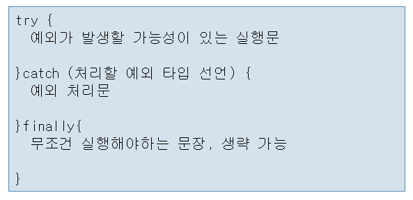
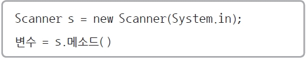
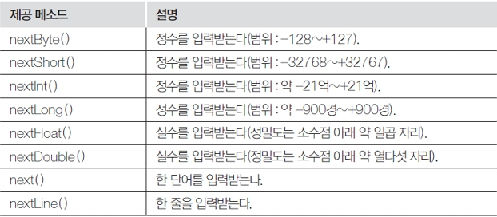

### Day 10(4/15 Fri)

---

[Interface](#interface)

[Exception](#exception)

[Stream](#stream)

##### Interface

___

* 다중 상속을 위해 사용
* public과 abstract는 자동으로 적용됨
* 메소드의 원형만 구현함
* 인터페이스를 구현한 클래스는 인터페이스상에 있는 추상 메소드를 전부 구현해야 함 
* 인터페이스는 객체를 만들 수 없습니다. 따라서 반드시 그 인터페이스를 구현한 클래스의 객체를 생성해서 사용

##### Exception

---

- 예외 처리를 하면 예외가 발생되서 프로그램이 끝나는 것이 아니라 나머지 루틴이 정상적으로 실행이 됩니다. 




##### Stream

---

###### Scanner






- scanner.next() 

```
import java.util.Scanner;
 
public class Ex10_07 {
    public static void main(String[] args) {
        Scanner s = new Scanner(System.in);
        String str1, str2, str3;
 
        System.out.print("단어 3개 입력  : ");
        str1 = s.next();
        str2 = s.next();
        str3 = s.next();
 
        System.out.print("입력된 문자열 ==> ");
        System.out.print(str1 + "," + str2 + "," + str3);
        
        s.close();
    }
}
```


* BufferedReader

```
import java.io.BufferedReader; 
import java.io.File; 
import java.io.InputStreamReader; 

public  class FileDirDemo1 { 
  public static void main(String args[]) { 
    /* 
     * System.in: 키보드 standard InputStream 
     * new InputStreamReader(System.in): 입력을 받아 문자 인코딩을 실행 
     * new BufferedReader();: 입력받은 문자를 버퍼에 저장하는 역활과 
     * 저장소 역활을 함  
     *  
     *                                          System.in 
     *                                          ↑   
     *                        InputStreamReader(System.in) 
     *                        ↑ 
     * new BufferedReader(new InputStreamReader(System.in)) 
     *  
     * Call By Reference 사용 
     * */ 
      BufferedReader in = new BufferedReader(new InputStreamReader(System.in)); 
      System.out.print("디렉토리를 입력해 주세요: "); 
       
      String directory=""; 
      try { 
          directory = in.readLine(); //키보드로부터 입력, Lock 
      } catch (Exception e) { 
        System.out.println("Error: " + e.toString()); 
      }     
```
